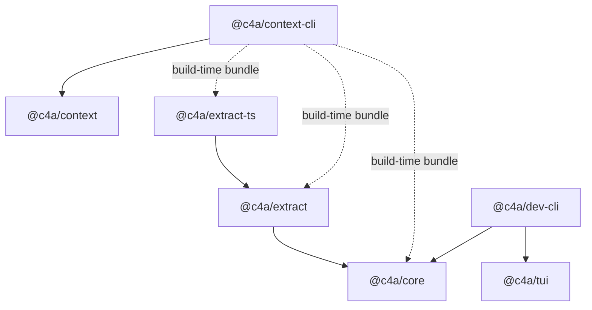

# Context

This is the standalone Context repository. It contains the local knowledge SDK,
CLI, extraction packages, Agent plugin sources, and development tooling. Hosted
server, storage, and web application stacks are outside its boundary.

## Package Topology



## Development Rules

- Use Bun for scripts: `bun run`, `bunx`, and `bun test`.
- Keep runtime code Node.js compatible; do not use Bun runtime APIs in package
  code unless the file is explicitly a build/test tool.
- Use ESM modules and `camelCase.ts` filenames.
- Build package entrypoints through `packages/build.ts` when bundling CLI or
  extractor-dependent code.
- Do not add hosted server, web, storage, model-download, or server-install
  flows to this workspace.
- `@c4a/context` is the SDK surface for `src/index.ts` project entries; `@c4a/context-cli`
  is the executable `context` command.

## Common Commands

```bash
bun run build
bun run typecheck
bun run test
bun run lint
bun run verify
bun run --filter @c4a/context-cli build
bun run --filter @c4a/dev-cli start
```

## Verification scope

- Local edits: run the affected package's typecheck/lint and relevant test files.
  Shared test fixtures require all their consumers; SDK/schema changes include
  affected downstream checks. Do not rerun the whole workspace for every edit.
- `bun run verify` runs workspace static checks and tests, including CLI
  integration tests. It is not a fast unit-only gate.
- `bun run verify:full` adds Node dist smoke checks; build required artifacts first.
  These commands are alternative scopes, not a ladder to execute in sequence.
- Reuse applicable passing results until inputs change. Collect failures once,
  fix them together and rerun the selected scope. Keep the current result summary
  separate from historical logs under `.tmp/`.
- Build and tests reading the same dist must not overlap. Prefer existing
  `build:workflow`, `build:plugin` or `build:indexers` scripts for resource-only
  changes; a full CLI build is still required when its bundled runtime changes.
- Test behavior, schemas, resolvable resources and safe recovery, not exact prose,
  document lengths or source-code spelling. Keep mutation fixtures isolated.

## Repository boundary

- This repository is developed and released independently from any parent
  monorepo or downstream distribution.
- `README.md` and `README.zh-CN.md` are the product entrypoints. Long-form
  integration case studies live under `docs/`, while static replay assets live
  under `case-studies/` and are published as documentation through GitHub
  Pages. They are not part of the hosted product or npm runtime.
- Keep generated files out of source control: `dist/`, `node_modules/`, `.tmp/`,
  coverage, and local caches.
