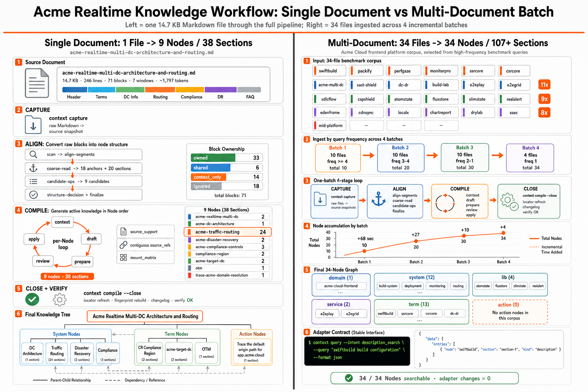

# Agentic Context System Over Compiled Knowledge

> [中文版本](./README_CN.md)

<p align="center"></p>

An Agentic knowledge system built for AI Agents. It pre-compiles Feishu docs, local Markdown, code structure, and hand-curated business material into structured, traceable knowledge, so an agent can perform high-precision search over it through a dedicated CLI.

This repository is the **local standalone build of C4A System**. The full C4A System will add online services with stronger multi-user collaboration support — releasing soon.

## Why C4A Context

When an AI agent looks up information in a project, it mostly relies on file search (e.g. `grep`) and full-text reading. As documents and codebases grow, two problems surface:

- **Slow retrieval**: the whole repo has to be scanned to locate the relevant piece;
- **Context bloat**: large amounts of raw text are pushed into the context window, dragging down downstream reasoning quality.

Vanilla RAG handles basic retrieval, but relying on Embedding-based chunk recall has inherent flaws: **vector models lose key information and distort semantics at both the indexing and retrieval stages, which significantly amplifies LLM hallucination**; meanwhile, the downstream LLM is far better at intent recognition than vector similarity, yet the upstream RAG stage already caps recall quality before the LLM gets to see it — overall accuracy is bounded by the upstream pipeline rather than by the model.

C4A Context takes a different path: **drop vector embeddings entirely, and let the LLM itself drive structured knowledge management and precise retrieval**. Each piece of raw material is pre-compiled into a typed structured knowledge unit (Section, classified as spec / example / warning / faq, etc.) carrying cross-references and traceable source quotes; the agent then queries that base through dedicated tools and lands on Node / Section-level content directly. Compilation runs through a harness-style loop — the CLI orchestrates small-window iterations of knowledge production, so the agent never has to ingest the whole corpus at once; at query time the CLI hits the Section index directly, with zero LLM calls on the runtime path. Backed by a standardized compile flow and a purpose-built query CLI, the knowledge base reaches a precision close to hand-curated material and **significantly outperforms** both file search and general-purpose RAG — benchmark scores approach 100%.

## Where it fits

**Producer side — long-term project knowledge maintenance**: compile material from different versions and sources into orthogonal structured content (each source non-redundant, with clear boundaries, independently maintainable), so the knowledge base doesn't bloat uncontrollably over time. Particularly suited to long-running large projects, multi-team collaboration, and complex business systems with many documentation sources.

**Consumer side — high-reliability agent workflows**: coding, on-call operations, QA, and similar scenarios with zero tolerance for hallucination and a need for stable, high-quality recall — eliminates fabricated agent output.

## Core capabilities

C4A Context creates a `.context/` workspace under your project directory (the name is configurable) and provides a complete closed loop:

- **Capture** — pull in Feishu docs, local Markdown, code structure, design specs, API specs, and other multi-source business material;
- **Compile** — let the AI process raw material into structured knowledge under a single protocol — not a summary, but typed Sections (spec / example / warning, etc.) with cross-references and source traceability;
- **Query & use** — query local structured knowledge directly from Claude / Cursor / Codex etc., landing on Node and Section precisely; or hand the whole knowledge base to another LLM;
- **Knowledge governance** — drop deprecated material and reclaim its derived knowledge in one go; the knowledge base self-checks integrity and self-heals.

Day to day, work loops through **capture → compile → query & use → governance**; you don't re-run everything from scratch — update incrementally on demand.

<p align="center"></p>

## Install

Every Agent needs the `context` CLI first:

```bash
npm i -g @c4a/context-cli
# or
bun add -g @c4a/context-cli
```

Then install the plugin matching the agent you use:

| Agent | Install |
|---|---|
| Claude Code | `/plugin marketplace add context4ai/context`, then `/plugin install context@c4a` |
| Cursor | Dashboard → Settings → Plugins → Import → `https://github.com/context4ai/context` |
| Codex CLI | `codex marketplace add context4ai/context` |
| Vercel-style skills (Windsurf / OpenCode / Cline / Copilot, etc.) | `npx skills add github:context4ai/context <skill-name>` |

Once installed, the agent exposes entry points like `/context:*` (Claude) or `/context-*` (Cursor).

> **Tip — updating the Claude Code plugin**: Claude Code caches the installed plugin locally. When upgrading to a new version, uninstall the old plugin first, run `context clean-cache`, then reinstall — this guarantees the new version takes effect immediately.

## Manual workflow

From your project directory:

1. **Init** — `/context:init` creates the `.context/` workspace;
2. **Capture** — `/context:capture <url-or-path>` pulls in Feishu docs, local Markdown, code snapshots, and so on;
3. **Code projection** — for code snapshots, `/context:compile --aspect code <source-slug>` materializes package/category/symbol Nodes such as `pkg`, `pkg/components`, and `pkg/symbol/button`;
4. **Align** — `/context:align` places prose material onto the Node structure, including docs or examples that should attach to existing code symbol Nodes;
5. **Compile** — `/context:compile` lets the AI turn prose material into structured Sections;
6. **Query** — `/context:query <question>` answers from local knowledge, citing Node and Section; code workspaces can filter mixed evidence with `--evidence code|prose|all`;
7. **Drop** — `/context:drop <source-id>` reclaims deprecated material and its derived Sections.

Each step writes readable files and a changelog under `.context/`, so you can review or roll back at any time.

## Automated workflow

After completing the **Install** step above, you can hand this document to an AI Agent (or an automation harness such as OpenClaw), point it at the project workspace and any existing knowledge base, and let it run the entire flow autonomously — cutting most of the manual work.

**Environment**: Claude Opus 4.6+ or Codex 5.5+ is recommended, so the agent can resolve instructions correctly and handle the decision/clarification steps during compile.

**Core automation prompt** — paste directly to the Agent or automation tool:

```
Please initialize a project knowledge base in the current directory (choose Chinese as the language; keep all other parameters as defaults), and run the full knowledge-management flow through the context CLI.

Knowledge sources (restrict to these):
- Feishu docs: https://[URLS]
- Local files: /local/path/*.md

Work includes but is not limited to: workspace init, multi-source capture, alignment, AI compile, and query validation. For any clarification or decision (source priority, compile-rule tweaks, knowledge-unit classification, etc.), make the call on your own and log every operation, keeping the knowledge base structured and traceable.
```

> Knowledge building is a long iterative process: it involves many detail-level decisions and clarifications. Automation can take over most of the repetitive work, but cannot fully replace human judgment.
> For engineering-critical knowledge (code structure, design specs, API details, etc.), prefer manual curation during the cold-start phase; once the base is stable, hand incremental updates and day-to-day governance to the Agent to avoid drift.

## Export & publish

The compiled knowledge base can be packaged for distribution:

- export as a **Skills** package — `context build --format skills-pack`;
- export as **LLMs.txt** — `context build --format llms`;
- [TODO] publish to the **C4A platform** as an MCP service for other AIs to query live;
- [TODO] publish as a standalone Plugin knowledge package, with retrieval quality on par with the MCP service and CLI.

## Recommended environment

Measured behavior of Agent + model combinations across instruction following, parameter hallucination, and extraction quality (scored 0–100):

| Agent | Model | Instruction following | Parameter hallucination | Extraction quality |
|---|---|---:|---|---:|
| Codex | GPT 5.5 xh | 95 | Almost none | 96 |
| Claude | Opus 4.6 / 4.7 | 95 | Almost none | 95 |
| Cursor | Opus 4.6 / 4.7 | 92 | Almost none | 85 |
| Claude | DeepSeek V4 | 70 | Frequent | 55 |
| Claude | DeepSeek V4 Flash | 55 | Frequent | 45 |

**Recommendation**: prefer GPT or Opus for now. DeepSeek V4 still lags in instruction following and extraction quality and needs further CLI optimization; full DeepSeek V4 adaptation is planned for v0.5.40, targeting an overall score above 90.

## About this repository

The contents of this repository are auto-generated and published by the [c4a project](https://github.com/context4ai/c4a) — do not edit by hand.

The c4a project provides end-to-end infrastructure for knowledge processing and hosting, covering the CLI, the knowledge-management Studio, and MCP services; open-source release is planned for late May 2026.

License: MIT
