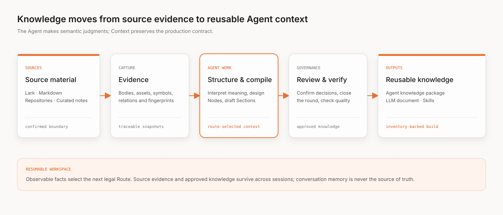

# Context

[](https://github.com/context4ai/context/actions/workflows/ci.yml)
[](https://www.npmjs.com/package/@c4a/context-cli)
[](./package.json)
[](./LICENSE)

Context is a knowledge production workflow built for Agents. It turns Lark
documents, local Markdown, code repositories, and curated business material
into structured, traceable knowledge, then builds that knowledge as Agent
knowledge packages, LLM-ready documents, or Skills.

The user describes what knowledge should be produced and where the source
material lives. The Agent reads evidence, proposes structure, and explains
decisions. Context keeps the workflow legal and repeatable: it records source
boundaries, checks evidence coverage, stages reviewable candidates, preserves
provenance, verifies the approved result, and builds the selected output.

> Start with a knowledge goal, not a command list.

[简体中文](./README.zh-CN.md) · [SDK guide](./packages/context/README.md) · [Agent integration](./packages/context-cli/README.md) · [Development](./DEVELOPMENT.md)

## What you can produce

Context is useful when knowledge exists but is not yet ready for an Agent to
consume. Common requests include:

- turn product, architecture, operations, or FAQ documents into a navigable
  knowledge base;
- connect code structure with explanatory documents while retaining exact
  source evidence;
- combine several repositories and document sets into one reviewed knowledge
  package;
- produce `wikis/`, `guides/`, `rules/`, `feats/`, a consolidated LLM text
  file, or package-specific Skills;
- update an existing knowledge workspace when its sources change, without
  rebuilding everything from memory.

Context is not a one-shot summarizer. It keeps source snapshots, review state,
approved knowledge, and package inventories in a local workspace so the result
can be inspected, versioned, and refreshed later.

## Start through your Agent

Install the Context Agent integration once:

```bash
npm install -g @c4a/context-cli@latest
context plugin install
```

Restart or refresh the Agent host, then invoke `/c4a:context`. This is the
single public entry for both new and existing workspaces. You do not need to
learn the lifecycle commands first; describe the knowledge goal in normal
language, for example:

```text
/c4a:context Build an Agent knowledge package from this repository and our
architecture documents. Keep code references traceable and ask me before
approving the final structure.
```

The installed entry contains the bootstrap contract, while the Context runtime
provides the complete workflow guidance, schemas, code-indexing capabilities,
and current next action. If the `context` runtime is missing, the entry explains
how to install it instead of guessing or partially initializing a workspace.

## One workflow, several kinds of knowledge



You can [watch a sanitized interactive replay of a real run](https://context4ai.github.io/context/case-studies/workflow/?lang=en) for a more intuitive view of the complete knowledge-building process and its [implementation principles](https://github.com/context4ai/context/blob/main/docs/en/case-studies/agent-graph-workflow.md).

The exact path depends on the sources and requested output, but the durable
workflow is:

1. **Define the goal and source boundary.** Decide which repositories,
   documents, or manually curated materials are in scope.
2. **Capture evidence.** Preserve document bodies, embedded resources, code
   symbols, relationships, and source fingerprints.
3. **Design the knowledge structure.** The Agent reads the selected evidence
   and proposes semantic collections, Nodes, and Sections for confirmation.
4. **Compile reviewable knowledge.** Drafts stay bound to source evidence and
   are checked for coverage, continuity, identity, and stale inputs.
5. **Review and close.** Approved decisions become durable Markdown and a
   closed structure projection; rejected candidates retain minimal fingerprints
   so unchanged material is not proposed again.
6. **Verify and build.** Context validates the approved workspace and produces
   the declared package or document output.

The workflow is not a fixed script. Current workspace facts select the next
legal Route, and the Agent loads only the procedures and resources needed for
that Route. Re-entering the same workspace resumes from its actual state rather
than replaying the conversation.

## Responsibility boundaries

| Participant | Owns |
|---|---|
| **User** | Knowledge goal, source permission, scope, structure choices, review decisions, and output intent |
| **Agent** | Reading evidence, semantic interpretation, proposing structure and content, explaining decisions, and editing declared project configuration |
| **Context** | Workspace facts, source capture, code indexing, evidence contracts, candidate identity, review application, verification, and deterministic builds |

Context does not call an LLM. It also does not silently clone repositories,
grant access to external sources, or infer that a human decision was made. In a
fully managed conversation, the Agent may use the workflow's delegated policies
to skip redundant review surfaces, but evidence, permissions, validation, and
verification remain intact.

## The local knowledge workspace

```text
context/
├── AGENTS.md       # project-local guidance for the Agent
├── src/            # source, phase, and package declarations
├── sources/        # registered sources and captured evidence
├── knowledge/      # approved knowledge and durable decisions
├── dist/           # generated knowledge packages (ignored)
└── .tmp/           # disposable runtime state and reports (ignored)
```

The CLI owns lifecycle writes under `sources/`, `knowledge/`, `dist/`, and
`.tmp/context-runtime/`; they are not ad-hoc scratch folders. The Agent changes
project configuration only when the current workflow Route asks for it and uses
the returned commands for state transitions.

## Output shapes

- **Agent knowledge package** — approved knowledge under `wikis/`, `guides/`,
  `rules/`, and `feats/`, plus optional Skills, indexes, and package-specific
  query helpers.
- **LLM document** — a consolidated text artifact for model context, offline
  evaluation, or downstream ingestion.
- **Project-owned package** — templates can add additional Agent instructions,
  static files, or retrieval tools while keeping the approved knowledge as the
  source of truth.

Every build emits an inventory that maps distributed files back to approved
workspace knowledge. Published pages keep reader-facing metadata; detailed
source and review evidence remains in the production workspace.

Context stops after producing a complete local build output. Publishing that
output to a hosted knowledge service or package registry belongs to an
explicitly installed downstream distribution tool; use its complete-output
upload path when available instead of reconstructing a remote installation.

## Repository map

| Module | Role in the workflow | Documentation |
|---|---|---|
| `@c4a/context` | Declarative project SDK for sources, phases, review gates, and outputs | [English](./packages/context/README.md) · [中文](./packages/context/README.zh-CN.md) |
| `@c4a/context-cli` | Local workflow runtime and Agent integration | [English](./packages/context-cli/README.md) · [中文](./packages/context-cli/README.zh-CN.md) |
| `@c4a/core` | Shared schemas, identities, errors, and extraction contracts | [English](./packages/core/README.md) · [中文](./packages/core/README.zh-CN.md) |
| `@c4a/extract` | Language-plugin protocol and repository extraction runner | [English](./packages/extract/README.md) · [中文](./packages/extract/README.zh-CN.md) |
| `@c4a/extract-ts` | TypeScript/TSX structure extraction | [English](./packages/extract-ts/README.md) · [中文](./packages/extract-ts/README.zh-CN.md) |
| `@c4a/extract-go` | Optional Go structure extraction | [English](./packages/extract-go/README.md) · [中文](./packages/extract-go/README.zh-CN.md) |
| `@c4a/extract-rush` | Optional Rush workspace structure index | [English](./packages/extract-rush/README.md) · [中文](./packages/extract-rush/README.zh-CN.md) |
| `@c4a/dev-cli` | Repository development and release menu | [English](./packages/dev-cli/README.md) · [中文](./packages/dev-cli/README.zh-CN.md) |
| `@c4a/tui` | Shared terminal components for development tools | [English](./packages/tui/README.md) · [中文](./packages/tui/README.zh-CN.md) |

Package names are technical distribution identifiers. User-facing knowledge
workflows, package templates, and generated content use the Context product
language and can be adapted by downstream distributions without carrying a
separate brand model.

## Documentation and development

- [SDK documentation index](./packages/context/docs/README.md)
- [Knowledge-project walkthrough](./packages/context/docs/getting-started.md)
- [Agent integration guide](./packages/context-cli/README.md)
- [Plugin contract](./packages/context-cli/plugin/README.md)
- [Workflow Provider internals](./packages/context-cli/context-workflow/README.md)
- [Contributing](./CONTRIBUTING.md)
- [Support](./SUPPORT.md)
- [Security policy](./SECURITY.md)
- [Release history](./CHANGELOG.md)

Repository development uses Bun; runtime packages remain compatible with
Node.js 20 or newer:

```bash
bun install
bun run verify
```

See [DEVELOPMENT.md](./DEVELOPMENT.md) for source, link, packaged-install, and
release workflows. These developer commands are not the normal user workflow;
users work through the installed Agent entry.
