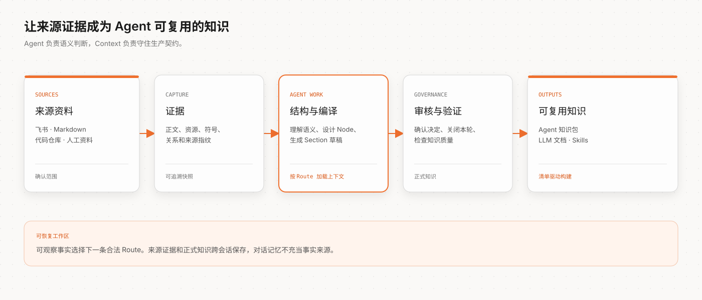

# Context

[](https://github.com/context4ai/context/actions/workflows/ci.yml)
[](https://www.npmjs.com/package/@c4a/context-cli)
[](./package.json)
[](./LICENSE)

Context 是一套专为 Agent 打造的知识生产工作流。它将飞书文档、本地
Markdown、代码仓库和人工整理的业务资料转化为结构化、可溯源的知识，再构建为
Agent 知识包、LLM 文档或 Skills。

用户说明要生产什么知识、资料在哪里；Agent 阅读证据、设计结构并解释关键决策；
Context 负责让整个过程合法且可重复：登记来源边界、检查证据覆盖、暂存可审查
候选、保留来源关系、验证正式知识，并构建用户选择的产物。

> 从知识目标开始，而不是从命令清单开始。

[English](./README.md) · [SDK 指南](./packages/context/README.zh-CN.md) · [Agent 接入](./packages/context-cli/README.zh-CN.md) · [开发指南](./DEVELOPMENT.md)

## 可以生产什么

当知识已经存在，但还不能直接被 Agent 稳定消费时，Context 可以帮助完成：

- 把产品、架构、运营、SOP 或 FAQ 文档整理为可导航的知识库；
- 将代码结构与说明文档关联起来，同时保留精确的来源证据；
- 把多个仓库和多组文档汇总为一份经过审核的知识包；
- 产出 `wikis/`、`guides/`、`rules/`、`feats/`、聚合后的 LLM 文本或项目专属
  Skills；
- 来源发生变化后更新已有知识工作区，而不是依赖对话记忆从头重做。

Context 不是一次性摘要工具。来源快照、审核状态、正式知识和构建清单都保存在
本地工作区中，因此结果可以查看、纳入版本管理并在以后持续更新。

## 从 Agent 开始使用

只需安装一次 Context Agent 接入：

```bash
npm install -g @c4a/context-cli@latest
context plugin install
```

重启或刷新 Agent 宿主，然后调用 `/c4a:context`。这是创建新工作区和继续已有
工作区的唯一公开入口。无需先学习生命周期命令，直接用自然语言说明知识目标即可，
例如：

```text
/c4a:context 请把当前仓库和架构文档整理成 Agent 知识包，代码引用必须可追溯，
最终结构在批准前先让我确认。
```

安装的入口只保留启动契约；Context 运行时会提供完整的工作流说明、Schema、代码
索引能力和当前下一步动作。如果本机缺少 `context` 运行时，入口会给出安装恢复
方法，不会猜测状态或只初始化一半工作区。

## 一套工作流，多种知识



你可以[观看真实运行的脱敏交互式回放](https://context4ai.github.io/context/case-studies/workflow/?lang=zh)，更直观地了解整个知识构建过程及其[实现原理](https://github.com/context4ai/context/blob/main/docs/zh-CN/case-studies/agent-graph-workflow.md)。

具体路径会随来源和产物变化，但长期稳定的工作流是：

1. **确认目标和来源边界。** 决定哪些仓库、文档或人工资料属于本次范围。
2. **采集证据。** 保存文档正文、内嵌资源、代码符号、关系和来源指纹。
3. **设计知识结构。** Agent 阅读当前选中的证据，提出语义分类、Node 和 Section，
   由用户确认。
4. **编译可审查知识。** 草稿始终绑定来源证据，并接受覆盖度、连续性、身份和
   过期输入检查。
5. **审核并关闭本轮。** 已批准决定写成持久 Markdown 和关闭后的结构投影；被
   拒绝候选只保留最小指纹，避免未变化内容反复出现。
6. **验证并构建。** Context 验证正式工作区，再生成声明好的知识包或文档产物。

这不是一条固定脚本。当前工作区事实会选择下一条合法 Route，Agent 只加载这条
Route 需要的操作说明和资源。再次进入同一工作区时，流程从真实状态继续，而不是
重放历史对话。

## 职责边界

| 参与方 | 负责内容 |
|---|---|
| **用户** | 知识目标、来源权限、范围、结构选择、审核决定和产物意图 |
| **Agent** | 阅读证据、语义判断、提出结构和内容、解释决策，以及按当前路线编辑项目声明 |
| **Context** | 工作区事实、来源采集、代码索引、证据契约、候选身份、审核应用、质量验证和确定性构建 |

Context 不调用 LLM，也不会静默克隆仓库、读取未授权外部来源，或推断用户已经做出
决定。在全托管对话中，Agent 可以依据工作流的 delegated policy 跳过重复审核
界面，但证据、权限、校验和验证不会被删除。

## 本地知识工作区

```text
context/
├── AGENTS.md       # 面向 Agent 的项目内说明
├── src/            # 来源、阶段和知识包声明
├── sources/        # 已登记来源和采集证据
├── knowledge/      # 审核通过的知识和持久决定
├── dist/           # 构建生成的知识包（忽略）
└── .tmp/           # 可丢弃运行状态和报告（忽略）
```

`sources/`、`knowledge/`、`dist/` 和 `.tmp/context-runtime/` 的生命周期写入由
CLI 负责，它们不是可以随意修改的临时目录。只有当前工作流 Route 要求时，Agent
才编辑项目配置，并使用 Route 返回的命令推进状态。

## 产物形态

- **Agent 知识包**：审核通过的知识位于 `wikis/`、`guides/`、`rules/` 和
  `feats/`，并可包含 Skills、索引和包专属查询工具。
- **LLM 文档**：用于模型上下文、离线评测或下游导入的聚合文本。
- **项目自定义包**：模板可以增加 Agent 说明、静态文件或检索工具，同时仍以正式
  知识作为事实来源。

每次构建都会输出一份清单，将分发文件映射回工作区内的正式知识。发布页只保留
面向读者的元数据；完整来源和审核证据继续留在生产工作区。

Context 在生成完整本地产物后结束。将产物发布到托管知识服务或包平台，属于显式
安装的下游分发工具职责；如果分发工具支持完整产物上传，应直接使用该入口，而不
是先重建一份远端安装基线。

## 仓库模块

| 模块 | 在知识生产链中的职责 | 文档 |
|---|---|---|
| `@c4a/context` | 声明来源、阶段、审核门禁和产物的项目 SDK | [English](./packages/context/README.md) · [中文](./packages/context/README.zh-CN.md) |
| `@c4a/context-cli` | 本地工作流运行时和 Agent 接入 | [English](./packages/context-cli/README.md) · [中文](./packages/context-cli/README.zh-CN.md) |
| `@c4a/core` | 共享 Schema、身份、错误和提取契约 | [English](./packages/core/README.md) · [中文](./packages/core/README.zh-CN.md) |
| `@c4a/extract` | 语言插件协议和仓库提取 Runner | [English](./packages/extract/README.md) · [中文](./packages/extract/README.zh-CN.md) |
| `@c4a/extract-ts` | TypeScript/JavaScript 与 TSX/JSX 结构提取 | [English](./packages/extract-ts/README.md) · [中文](./packages/extract-ts/README.zh-CN.md) |
| `@c4a/extract-go` | 可选 Go 结构提取 | [English](./packages/extract-go/README.md) · [中文](./packages/extract-go/README.zh-CN.md) |
| `@c4a/extract-rush` | 可选 Rush 工作区结构索引 | [English](./packages/extract-rush/README.md) · [中文](./packages/extract-rush/README.zh-CN.md) |
| `@c4a/dev-cli` | 仓库开发和发布菜单 | [English](./packages/dev-cli/README.md) · [中文](./packages/dev-cli/README.zh-CN.md) |
| `@c4a/tui` | 开发工具共用的终端组件 | [English](./packages/tui/README.md) · [中文](./packages/tui/README.zh-CN.md) |

包名只是技术分发标识。面向用户的知识工作流、知识包模板和生成内容统一使用
Context 产品语义，下游分发无需继承另一套品牌模型。

## 文档与开发

- [SDK 文档索引](./packages/context/docs/README.zh-CN.md)
- [知识项目完整示例](./packages/context/docs/getting-started.md)
- [Agent 接入指南](./packages/context-cli/README.zh-CN.md)
- [插件契约](./plugins/context/README_CN.md)
- [Workflow Provider 内部说明](./packages/context-cli/context-workflow/README.zh-CN.md)
- [参与贡献](./CONTRIBUTING.md)
- [获取支持](./SUPPORT.md)
- [安全策略](./SECURITY.md)
- [发布记录](./CHANGELOG.md)

仓库开发使用 Bun，运行时包保持兼容 Node.js 20 及以上版本：

```bash
bun install
bun run verify
```

源码、link、打包安装和发布流程参见 [DEVELOPMENT.md](./DEVELOPMENT.md)。这些是
维护者命令，不是普通用户的知识生产入口；用户通过已安装的 Agent 入口工作。
