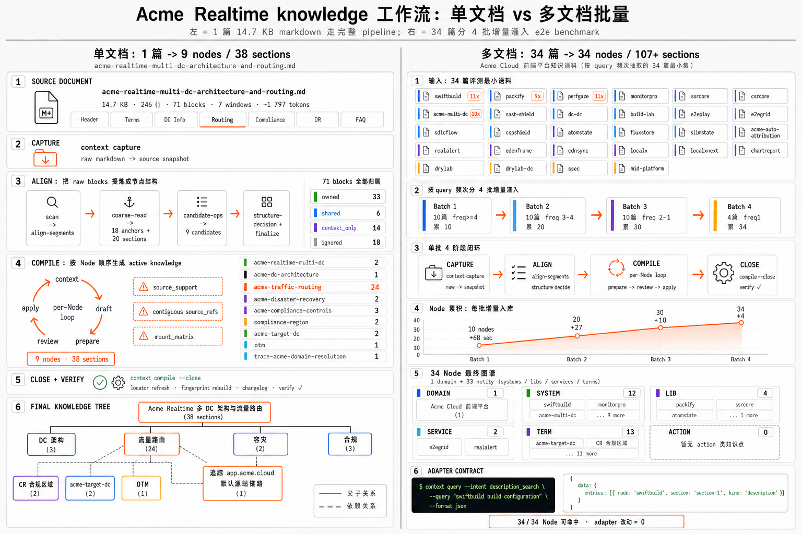

# Context: Build Agent-Facing Knowledge

> [English](./README.md)

<p align="center"></p>

专为 Agent 打造的中小团队知识工作流，将飞书文档、本地 Markdown、代码、人工整理的业务资料编译为结构化、可溯源的知识，再指导 Agent 通过最佳的推理模式和探查知识完成高质量检索。本工具运行在支持 Plugin （Skill + Command） 的 Agent 环境中。

## 为什么选择 C4A Context

普通 AI 智能体在项目中查找资料，大多依赖文件检索（如 `grep`）和全文阅读。随着文档、代码体量变大，会暴露出两个核心问题：

- **检索效率低下**：需要全盘扫描仓库内容才能定位关键信息；
- **上下文冗余膨胀**：大量原始文本被注入上下文窗口，直接拉低后续推理质量。

传统 RAG 虽能解决基础检索问题，但依赖 Embedding 向量分片召回存在天然缺陷：**无论在生产环节还是检索环节，向量模型都会造成关键信息丢失、语义失真，显著放大大模型幻觉问题**；同时，明明 LLM 本身的意图识别能力远强于向量相似度，前置 RAG 检索环节却先一步拉低召回质量，整体精度的上限被前置链路封顶。

C4A Context 采用全新思路：**放弃向量嵌入依赖，直接基于大模型完成知识的结构化管理与精准检索**。将各类原始资料预编译为按类型分类、带交叉引用、能溯源到原文的结构化知识单元（Section），智能体通过查询工具精准命中 Node / Section 级内容。编译阶段通过类似 Harness 的机制，让 Agent 按 CLI 的意图在小上下文窗口内循环完成知识生产任务，绕开一次性塞入大段原文造成的上下文膨胀；查询阶段直接走 CLI 在 Section 索引上命中，运行时无需调用 LLM。依托标准化编译流程与专用查询能力，知识库精度接近人工梳理效果，综合表现**显著优于**传统文件检索与通用 RAG —— benchmark 得分接近 100%。

## 适合场景

**生产侧 — 项目知识的长期维护**：把不同版本、不同来源的资料编译为彼此正交的结构化内容（各来源知识互不冗余、边界清晰、可独立维护），避免知识库随时间膨胀失控。尤其适合长期迭代的大型项目、多团队协作、多文档来源的复杂业务系统。

**消费侧 — Agent 协作的高可靠工作流**：编码、线上运维、质量保障等对幻觉零容忍、要求召回稳定的场景，杜绝 Agent 编造内容。

## 核心能力

C4A Context 在项目目录下创建 `.context/` 工作目录（目录名可自定义），提供完整闭环能力：

- **采集**：拉取飞书文档、本地 Markdown、代码结构、设计规范、接口文档等多源业务资料；
- **编译**：由 AI 按统一协议将原始素材加工为结构化知识 — 并非简单摘要，而是按类型分类（spec / example / warning 等）、附带交叉引用与原文溯源的标准化 Section；
- **检索使用**：在 Claude / Cursor / Codex 等工具中直接查询本地结构化知识，精准定位 Node 与 Section；也可将完整知识库导入其他大模型使用；
- **知识治理**：支持废弃资料撤回，连带派生知识同步回收；自动校验知识库完整性，实现问题自愈。

日常使用围绕 **采集 → 编译 → 检索使用 → 知识治理** 形成闭环，无需全量重复执行，按需增量更新。

<p align="center"></p>

## 安装

所有 Agent 均需先安装 `context` 命令行工具：

```bash
npm i -g @c4a/context-cli
# 或
bun add -g @c4a/context-cli
```

随后按所用 Agent 安装对应插件：

| Agent | 安装方式 |
|---|---|
| Claude Code | `/plugin marketplace add context4ai/context`，再执行 `/plugin install context@c4a` |
| Cursor | Dashboard → Settings → Plugins → Import → `https://github.com/context4ai/context` |
| Codex CLI | `codex marketplace add context4ai/context` |
| Vercel-style skills（Windsurf / OpenCode / Cline / Copilot 等） | `npx skills add github:context4ai/context <skill-name>` |

安装完成后，在对应 Agent 中即可通过 `/context:*`（Claude）或 `/context-*`（Cursor）等入口调用。

> **Tip — Claude Code 插件更新**：Claude Code 插件存在本地缓存，升级到新版本时建议先卸载旧插件，执行 `context clean-cache` 清理缓存，再重新安装，确保新版本立即生效。

## 手动流程

进入项目目录后：

1. **初始化** — `/context:init` 创建 `.context/` 工作目录；
2. **采集** — `/context:capture <url-or-path>` 拉取飞书文档、本地 Markdown、代码快照等原始资料；
3. **代码投影** — 对代码快照执行 `/context:compile --aspect code <source-slug>`，生成 `pkg`、`pkg/components`、`pkg/symbol/button` 这类 package/category/symbol Node；
4. **对齐** — `/context:align` 将文档原料归位至 Node 结构，包括挂靠到已有 code symbol Node 的手册、示例和经验；
5. **编译** — `/context:compile` 由 AI 将文档原料加工为结构化 Section；
6. **检索** — `/context:query <问题>` 在本地知识中查询答案，返回 Node 与 Section 级引用；代码工作区可用 `--evidence code|prose|all` 区分代码证据和文档证据；
7. **撤回** — `/context:drop <source-id>` 回收废弃资料及其派生 Section。

每一步都会在 `.context/` 中留下可读文件与 changelog，支持随时回看与回滚。

## 自动化流程

完成前文「安装」步骤后，可直接让 AI Agent 或龙虾（OpenClaw）等自动化工具阅读本文档，指定项目工作区目录，引用存量知识目录自主开展全流程工作，大幅降低人工操作成本。

**环境要求**: 建议使用 Claude Opus 4.6+ 或 Codex 5.5 及以上版本，确保 Agent 能精准解析指令、处理知识编译中的决策与澄清工作。
**自动化核心指令**：可直接复制给 Agent/龙虾工具
```
请你在当前目录初始化项目知识库（配置选择中文，其余参数按默认设置），并通过 context 工具完成全流程知识管理工作。

知识来源（仅限以下）：
- 飞书文档：https://[URLS]
- 本地文件：/local/path/*.md

工作内容包括但不限于：工作区初始化、多源资料采集、知识对齐、AI 编译、检索校验。过程中所有需要澄清的细节、决策类事项（如资料优先级、编译规则微调、知识单元分类等），由你自主把控并记录操作日志，确保知识库结构化、可溯源。
```
> 知识建设是长期迭代的过程，涉及大量细节决策与需求澄清，自动化工具可承担大部分重复性工作，但无法完全替代人工判断；
> 建议研发类核心知识（如代码结构、设计规范、接口细节等）在冷启阶段以人工维护为主，待知识库框架稳定后，再交由 Agent 负责增量更新与日常治理，避免核心知识偏差


## 导出与发布

完整知识库支持对外打包发布：

- 导出为 **Skills** 包：`context build --format skills-pack`；
- 导出为 **LLMs.txt**：`context build --format llms`；
- [TODO] 发布至 **C4A 平台**，作为 MCP 服务供其他 AI 实时查询；
- [TODO] 发布为独立 Plugin 知识包，具备与 MCP 及 CLI 同等精度的检索能力。

## 环境推荐

下方数据来自一次并发基准测试：每个模型在同一份 10 篇业务文档语料上端到端跑完 c4a 全流程（capture → align → compile），无人工介入。质量按 7 个维度评分（总分 100）反映产物知识库；耗时覆盖 `context init` 到 `compile close` 的全流程。

| 维度 | GPT 5.5 xh fast（Codex） | GPT 5.5 m fast（Codex） | Opus 4.8（Claude） | Sonnet 4.6（Claude） | DeepSeek V4 Pro（Claude） | DeepSeek V4 Flash（Claude） |
|---|---:|---:|---:|---:|---:|---:|
| 事实覆盖（25） | 24 | 24 | 24 | 23 | 23 | 23 |
| 事实忠实（25） | 25 | 25 | 25 | 25 | 25 | 25 |
| 结构语义（15） | 15 | 15 | 15 | 14 | 13 | 14 |
| URL（5） | 5 | 5 | 5 | 5 | 5 | 5 |
| 证据链（10） | 10 | 10 | 10 | 10 | 10 | 8 |
| Section 边界（10） | 9 | 9 | 8 | 9 | 7 | 5 |
| 建模（10） | 9 | 9 | 8 | 8 | 9 | 7 |
| **总分** | **97** | **97** | **95** | **94** | **92** | **87** |
| 总耗时 | 5m44s | 4m34s | 20m27s | 20m20s | 11m22s | 2m40s |

## 关于本仓库

本仓库内容由 [c4a 项目](https://github.com/context4ai/c4a) 自动生成发布，请勿手动编辑。

该项目提供端到端的知识处理与托管基础设施，涵盖 CLI 工具、知识管理 Studio、MCP 服务等，预计 2026 年 5 月底开源。

License: MIT
