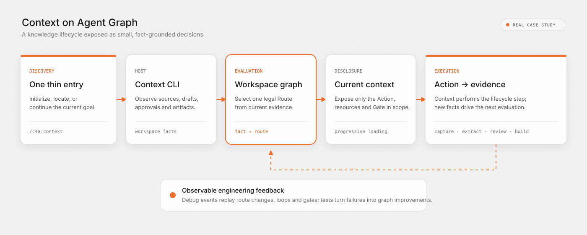

# How Context uses Agent Graph

[简体中文](../../zh-CN/case-studies/agent-graph-workflow.md) · [Interactive replay](https://context4ai.github.io/context/case-studies/workflow/?lang=en)

Context is a knowledge-management tool that turns code repositories and documents into reviewed, attributable knowledge packages. Its lifecycle is long enough to need explicit routing: sources must be scoped and captured, code and prose follow different production paths, human gates may pause the run, and approved knowledge must be closed, verified, and built.

Context uses Agent Graph as its work-contract layer. Agent Graph does not extract code, interpret documents, or approve knowledge. Context remains the host: it observes workspace facts, executes lifecycle actions, enforces authority, and produces evidence. Agent Graph evaluates those facts and selects the next legal Route.

## One public entry, one workflow

The public Context plugin exposes one Agent entry:

- [`/c4a:context`](https://github.com/context4ai/context/blob/main/packages/context-cli/plugin/commands/context.md), generated from `context.md`, starts a requested knowledge workspace or continues an existing one. Its first `context entry` call resolves initialization, workspace relocation, or current workflow evaluation before handing control to `workflow.current`.

The entry is intentionally thin. It describes the CLI bootstrap and Route-consumption contract instead of duplicating the product lifecycle. Detailed guidance stays distributed across independently addressable workflow resources and Action contracts.

Phase-specific instructions, schemas, source views, review contracts, and package guidance stay in those resources. The selected Route exposes only the subset needed now, and the same public entry handles both initialization and continuation without maintaining two overlapping prompts.

This prevents every invocation from loading the entire knowledge lifecycle into the prompt. The detailed documents have not disappeared; the single entry replaces the need to embed all of them in a Skill. A stable shell remains easy to discover, while the CLI can evolve detailed workflow resources without making the entry itself a large manual.

## Inspect the integration itself

The complete integration is public under [`context-workflow/`](https://github.com/context4ai/context/tree/main/packages/context-cli/context-workflow). It is a concrete example of a thin Skill backed by a larger, independently testable work contract:

- [`provider.yaml`](https://github.com/context4ai/context/blob/main/packages/context-cli/context-workflow/provider.yaml) binds the `workspace` Graph, code catalog, Actions, Resources, and entrypoint.
- [`graphs/workspace.yaml`](https://github.com/context4ai/context/blob/main/packages/context-cli/context-workflow/graphs/workspace.yaml) is the static lifecycle: 32 Action, Gate, and terminal nodes plus the legal transitions between them.
- [`actions/`](https://github.com/context4ai/context/tree/main/packages/context-cli/context-workflow/actions) contains 25 executable contracts. An Action describes the host command, effect, authority boundary, and expected outcome; it does not carry the long-form manual.
- [`resources/`](https://github.com/context4ai/context/tree/main/packages/context-cli/context-workflow/resources) contains independently addressable workflow guidance. Procedures explain the current task, dialogue files explain a human decision, views materialize live workspace facts, semantic references guide judgment, diagnostics explain failures, and manuals document stable APIs.
- [`codes.yaml`](https://github.com/context4ai/context/blob/main/packages/context-cli/context-workflow/codes.yaml) gives Route and diagnostic codes stable meaning without putting paragraphs into routine machine output.
- [`tests/`](https://github.com/context4ai/context/tree/main/packages/context-cli/context-workflow/tests) checks route selection from facts without running an Agent or model.

`context status` is the host-facing observation boundary. It inspects the workspace, supplies Facts to Agent Graph, and returns `workflow.current`: the selected Route, reason code, command plan, Gate, and only the Resources needed now. Static files can be acknowledged by digest; dynamic views are tied to the workflow revision that selected them. A receipt proves delivery of a resource—it does not claim that the outside task is complete.

This is how one small public entry can safely front a much larger body of instructions. The detailed material has not been removed or summarized away; it is separated, selected by the Graph, and made verifiable instead of being loaded on every turn.

## Idempotent continuation

Invoking a Skill again does not mean replaying every instruction or repeating every write. With the same Provider bundle, observed Facts, and recorded Outcomes, Agent Graph deterministically selects the same Route; unchanged resource receipts also preserve the same read state. Context then binds mutating commands to the selected workflow revision and verifies their external evidence. Work already satisfied by workspace facts is skipped or advances to the next Route, while a stale command is rejected instead of being applied to newer state.

This makes interruption, retry, and a new Agent turn converge from observable state rather than conversation memory. The idempotency boundary is explicit: Agent Graph makes evaluation repeatable and exposes completion contracts; the Context host makes each filesystem effect atomic, guarded, or a proven no-op. Agent Graph does not make an arbitrary script idempotent by itself.

## Responsibility boundary

| Layer | Responsibility in Context |
|---|---|
| Skill | Discovery and the small Route-consumption contract |
| Context host | Observe files and external systems, execute commands, enforce authority, record evidence |
| Provider | Bind the `workspace` Graph, entrypoints, Actions, resources, and reason-code catalog |
| Graph | Describe legal lifecycle states, dependencies, Gates, loops, and terminal outcomes |
| Route | Expose one current action, its required resources, and its completion contract |
| Facts and Outcomes | Prove what has actually happened; conversation claims are not completion evidence |

The integration keeps its Graph nodes, human and authority Gates, Action descriptors, addressable resources, and route tests in the published workflow directory. The replay's **Workspace graph** control visualizes this static contract; each replay step links its selected Action and Resources back to the source files above. Keeping the case study beside the workflow avoids copying change-prone inventory counts into a separate repository.

## One graph, two knowledge paths

Code and prose share a workspace but do not pretend to be the same workflow:

1. Source facts establish the permitted code modules and documents.
2. Document capture loops until every declared source has an auditable snapshot.
3. Code extraction loops by module, then pauses at a code-candidate review Gate.
4. Prose alignment confirms evidence-backed page structures before compilation.
5. Prose compilation loops by confirmed target, then presents one complete review batch.
6. Deterministic close, verification, and build produce the consumer package.

Repeated sources do not require repeated graph definitions. The graph contains stable states such as “a capture target remains” or “a confirmed structure remains uncompiled.” Runtime Facts identify which source or module is current. This keeps the work graph static while allowing batches to vary by project and run.

## Context managed mode maps to delegated Gates

Context calls its host-level experience “managed mode.” The host maps that choice to session-scoped Agent Graph authorities and Gate `delegated` policies; managed mode is not an Agent Graph protocol field. Context can then continuously execute deterministic Routes. It stops when the selected Route needs semantic judgment, unresolved authority, a human decision, or a repair that cannot be proven safe. Session authority may resolve eligible Gates, but it does not become permanent project configuration.

The result is a useful division of labor: loops and mechanical transitions do not consume repeated Agent turns, while decisions that change meaning or authority remain visible.

## Recording and replay

When Context debug mode is enabled, the host records CLI invocation boundaries and Agent Graph evaluations. A replay can then show:

- which semantic Route was selected at each fact change;
- where a multi-source loop advanced and how many iterations completed;
- when an authority or review Gate paused progress;
- which reason code justified the transition;
- how the final package outcome was reached.

The [interactive case-study replay](https://context4ai.github.io/context/case-studies/workflow/?lang=en) is a sanitized projection of a real run. Route order, repeated evaluations, statuses, reason codes, and relative timing are preserved. Source content, local paths, credentials, opaque IDs, and organization-specific names are excluded.

The recording is more than a presentation layer. Route traces expose inefficient loops, repeated resource reads, incomplete recovery paths, and misleading status priorities. Those observations become deterministic route tests and graph changes, closing the Graph Engineering feedback loop.

## What this case demonstrates

Context is not evidence that every Skill needs a graph. It is evidence that a graph becomes useful when a Skill fronts a long, stateful product workflow with external facts, multiple Gates, repeated batches, and a real recovery requirement.

The single entry remains small because the graph, resources, and host share the rest of the responsibility. The Agent sees what matters now; the host proves what happened; the graph keeps the next move legal and testable.
