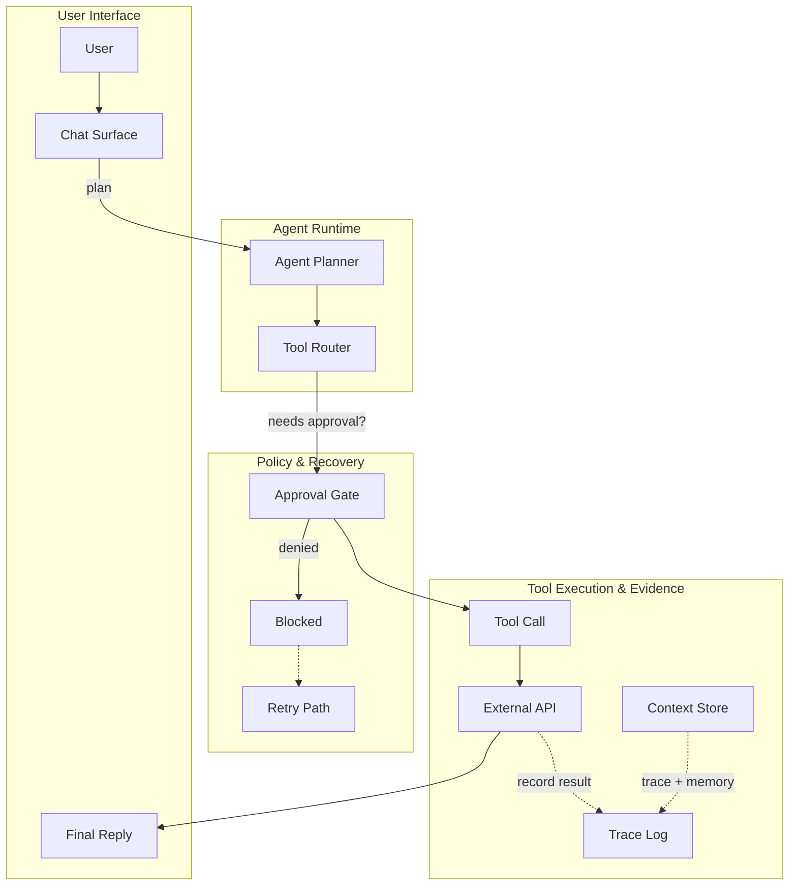
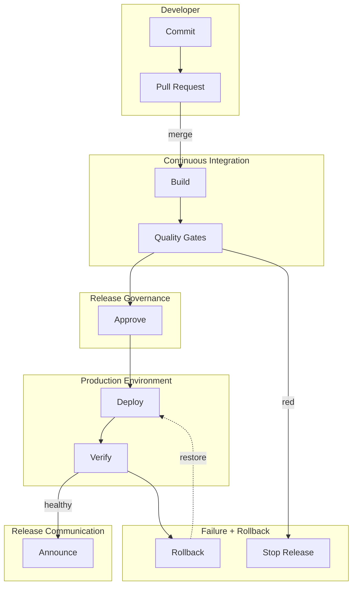
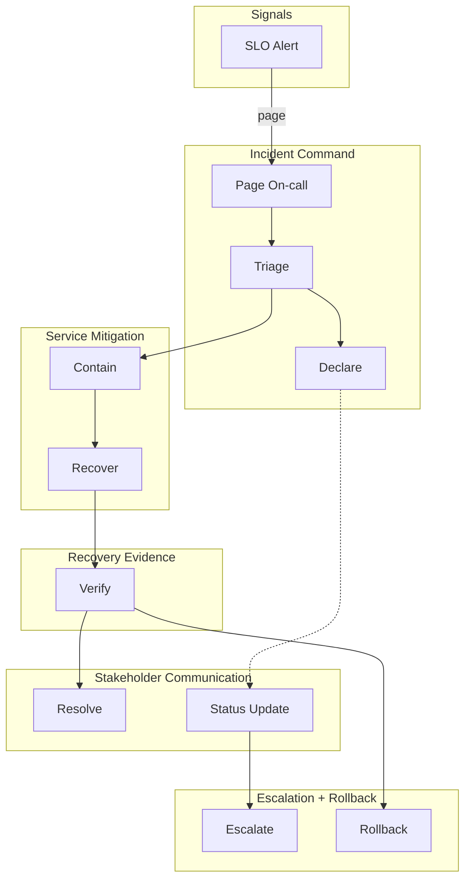
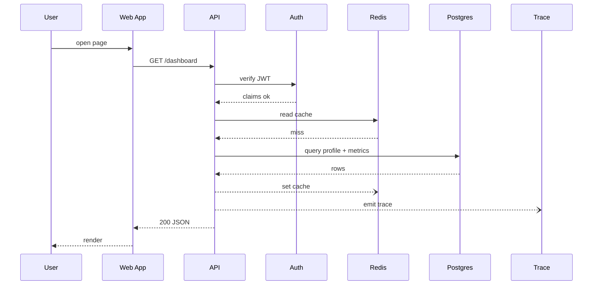
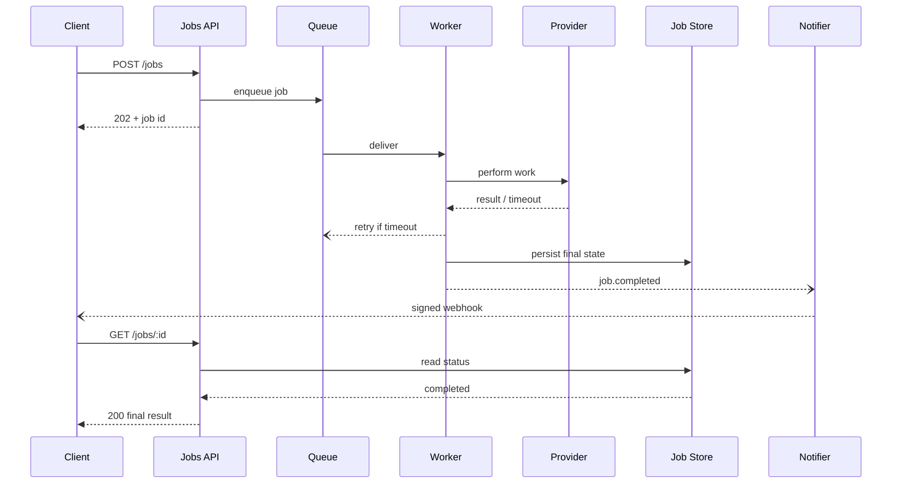
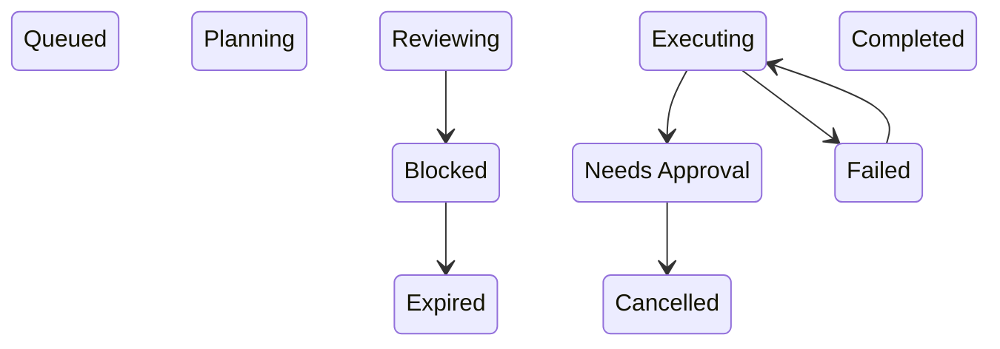
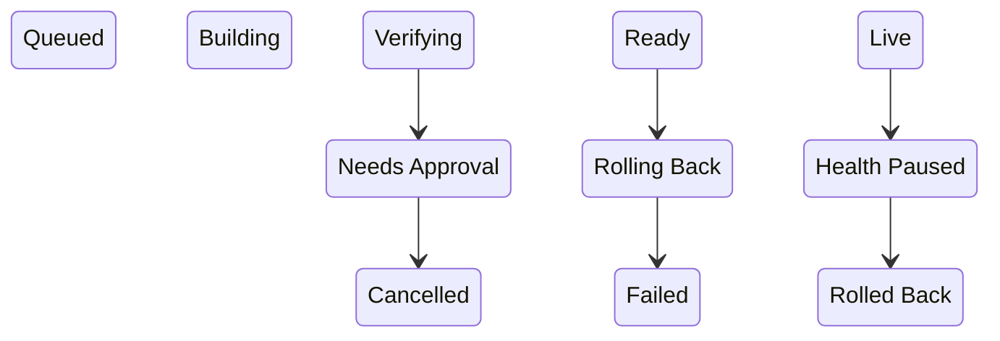

# Workflow, sequence and lifecycle examples

Read only the case selected by [the scenario guide](diagrams.md). These examples are synthetic upstream teaching material, not evidence for a user's system. Mermaid preserves explicit nodes and relationships; adjacent tables and verbatim cards retain details that do not belong inside a node. Original color, routing and compiler observations describe Archify, not a promise of identical Mermaid geometry. No example establishes behavior absent from an authorized source. Attribution and MIT permission are in [the guide](diagrams.md#attribution).

## Agent Tool Call Workflow

Source: agent-tool-call.workflow.json (`tt-a1i/archify`, `blob/72c750b/archify/examples/agent-tool-call.workflow.json`).

**All participants and semantic details**

| ID | Label | Detail | Type | Tag | Group |
| --- | --- | --- | --- | --- | --- |
| user | User | asks for work | external |  | ui |
| chat | Chat Surface | thread + files | frontend |  | ui |
| final | Final Reply | answer + changes | backend |  | ui |
| planner | Agent Planner | plan next step | backend | context aware | agent |
| router | Tool Router | choose capability | backend |  | agent |
| approval | Approval Gate | scope + consent | security | block risky ops | policy |
| blocked | Blocked | wait or reject | security |  | policy |
| retry | Retry Path | revise request | messagebus |  | policy |
| tool | Tool Call | shell / browser / MCP | messagebus | structured result | tools |
| external | External API | network service | cloud |  | tools |
| store | Context Store | repo + memory | database |  | tools |
| trace | Trace Log | events + output | database |  | tools |

**Relationship semantics**

| From → to | Label | Kind | Classification / role |
| --- | --- | --- | --- |
| user → chat |  | default |  |
| chat → planner | plan | emphasis |  |
| planner → router |  | default |  |
| router → approval | needs approval? | security |  |
| approval → tool |  | emphasis |  |
| approval → blocked | denied | security | error |
| blocked → retry |  | dashed | branch |
| tool → external |  | default |  |
| external → final |  | emphasis | return |
| external → trace | record result | dashed |  |
| store → trace | trace + memory | dashed |  |

Main path (upstream): user → chat → planner → router → approval → tool → external → final.

Phase **Intake**: upstream columns 0–1.

Phase **Plan + route**: upstream columns 2–3.

Phase **Execute + report**: upstream columns 4–5.

Group **Planning loop**: agent, upstream columns 2–3.

Group **Human or policy stop**: policy, upstream columns 3–5.

Group **Evidence path**: tools, upstream columns 1–2.

Group **Tool work**: tools, upstream columns 4–5.

**Request to result** (user, chat, planner, router, approval, tool, external, final): Follow the successful request from user intent to the final reply.

**Policy and recovery** (router, approval, blocked, retry): See where risky work stops, waits for consent, or returns for revision.

**Evidence and memory** (external, store, trace): Isolate the durable trace and context path behind the visible answer.

**Compiler Contract**

- Lanes and columns determine node placement
- Labels reserve clearance; routes stay orthogonal

**Runtime Semantics**

- Approval gates risky work before tool execution
- Evidence returns through isolated trace and memory

## Release Delivery Workflow

Source: release-delivery.workflow.json (`tt-a1i/archify`, `blob/72c750b/archify/examples/release-delivery.workflow.json`).

**All participants and semantic details**

| ID | Label | Detail | Type | Tag | Group |
| --- | --- | --- | --- | --- | --- |
| commit | Commit | signed change | frontend |  | dev |
| pull_request | Pull Request | reviewed diff | frontend |  | dev |
| build | Build | locked inputs | backend | reproducible | ci |
| checks | Quality Gates | test + scan | security | blocking | ci |
| approval | Approve | release owner | security | human gate | approval |
| deploy | Deploy | canary 10% | cloud | production | environment |
| verify_prod | Verify | smoke + SLO | backend |  | environment |
| announce | Announce | status + notes | external |  | communication |
| failed | Stop Release | gate failed | security |  | exceptions |
| rollback | Rollback | last good image | messagebus | owner: on-call | exceptions |

**Relationship semantics**

| From → to | Label | Kind | Classification / role |
| --- | --- | --- | --- |
| commit → pull_request |  | default |  |
| pull_request → build | merge | emphasis |  |
| build → checks |  | default |  |
| checks → approval |  | emphasis |  |
| approval → deploy |  | security |  |
| deploy → verify_prod |  | default |  |
| verify_prod → announce | healthy | emphasis |  |
| checks → failed | red | security | error |
| verify_prod → rollback |  | security | error |
| rollback → deploy | restore | dashed | return |

Main path (upstream): commit → pull_request → build → checks → approval → deploy → verify_prod → announce.

Phase **Change**: upstream columns 0–1.

Phase **Build + verify**: upstream columns 2–3.

Phase **Promote + observe**: upstream columns 4–5.

Group **Blocking checks**: ci, upstream columns 2–3.

Group **Recovery path**: exceptions, upstream columns 3–5.

**Commit to green build** (commit, pull_request, build, checks): Follow the change through reproducible build and blocking quality gates.

**Approve and promote** (checks, approval, deploy, verify_prod, announce): See who authorizes production and how success is verified.

**Failure and rollback** (checks, failed, verify_prod, rollback, deploy): Isolate the two places where delivery stops or reverses safely.

**One Happy Path**

- Every change is reviewed before a reproducible build
- Blocking checks must be green before human approval
- Production is complete only after smoke and SLO verification

**Stop Conditions**

- Test or security failure stops promotion
- Production health can reverse a release
- Rollback ownership is visible before an incident

**Release Evidence**

- Approval, immutable image, and check results are retained
- The release announcement follows verification
- The main path remains readable without hiding failure

## Incident Response Runbook

Source: incident-response.workflow.json (`tt-a1i/archify`, `blob/72c750b/archify/examples/incident-response.workflow.json`).

**All participants and semantic details**

| ID | Label | Detail | Type | Tag | Group |
| --- | --- | --- | --- | --- | --- |
| alert | SLO Alert | burn rate | messagebus |  | signals |
| page | Page On-call | acknowledge | external |  | responders |
| triage | Triage | scope impact | backend |  | responders |
| declare | Declare | assign commander | security | SEV-1/2 | responders |
| contain | Contain | stop growth | backend |  | mitigation |
| recover | Recover | restore | cloud |  | mitigation |
| verify | Verify | SLO + traces | database | 15 min stable | recovery |
| close | Resolve | final update | external |  | communication |
| update | Status Update | impact + ETA | frontend |  | communication |
| escalate | Escalate | specialist | security |  | exceptions |
| rollback | Rollback | last good | messagebus |  | exceptions |

**Relationship semantics**

| From → to | Label | Kind | Classification / role |
| --- | --- | --- | --- |
| alert → page | page | emphasis |  |
| page → triage |  | default |  |
| triage → contain |  | emphasis |  |
| contain → recover |  | default |  |
| recover → verify |  | emphasis |  |
| verify → close |  | emphasis |  |
| triage → declare |  | security |  |
| declare → update |  | dashed |  |
| update → escalate |  | security |  |
| verify → rollback |  | security | error |

Main path (upstream): alert → page → triage → contain → recover → verify → close.

Phase **Detect**: upstream columns 0–1.

Phase **Triage + mitigate**: upstream columns 2–3.

Phase **Verify + close**: upstream columns 4–5.

Group **Incident command**: responders, upstream columns 1–3.

Group **If impact persists**: exceptions, upstream columns 3–5.

**Detect and establish command** (alert, page, triage, declare): Follow the first minutes from signal to an owned incident.

**Mitigate and prove recovery** (triage, contain, recover, verify, close): Keep mitigation separate from the evidence required to close.

**Escalation and communication** (declare, escalate, update, rollback): See who is paged, what stakeholders hear, and when rollback begins.

**Ownership First**

- A page is not an incident until someone owns command
- Severity and scope are explicit before mitigation spreads
- Escalation names the missing expertise

**Recovery Is Evidence**

- Mitigation can reduce impact without proving recovery
- SLOs and traces must stay healthy for a fixed window
- The final update follows verification, not optimism

**Communication Contract**

- Stakeholders receive impact, action, and next update time
- Rollback remains visible as a deliberate response
- Every branch has an owner and observable exit

## Cache Miss Request Sequence

Source: cache-miss-request.sequence.json (`tt-a1i/archify`, `blob/72c750b/archify/examples/cache-miss-request.sequence.json`).

**All participants and semantic details**

| ID | Label | Detail | Type | Tag | Group |
| --- | --- | --- | --- | --- | --- |
| user | User | browser session | external |  |  |
| web | Web App | React UI | frontend |  |  |
| api | API | request handler | backend |  |  |
| auth | Auth | JWT verify | security |  |  |
| redis | Redis | cache | database |  |  |
| db | Postgres | source of truth | database |  |  |
| trace | Trace | async event | messagebus |  |  |

**Relationship semantics**

| From → to | Label | Kind | Classification / role |
| --- | --- | --- | --- |
| user → web | open page | default |  |
| web → api | GET /dashboard | emphasis |  |
| api → auth | verify JWT | security |  |
| auth → api | claims ok | return |  |
| api → redis | read cache | default |  |
| redis → api | miss | return |  |
| api → db | query profile + metrics | emphasis |  |
| db → api | rows | return |  |
| api → redis | set cache | dashed |  |
| api → trace | emit trace | dashed |  |
| api → web | 200 JSON | return |  |
| web → user | render | return |  |

Sequence segment: **Request**.

Sequence segment: **Fallback**.

Sequence segment: **Response + trace**.

**Request and identity** (user, web, api, auth): Follow the user request through the authentication check.

**Cache fallback** (api, redis, db): See the cache miss and the source-of-truth query it triggers.

**Return and trace** (db, api, redis, trace, web, user): Separate response latency from the non-blocking observability write.

**Happy Path**

- The main request is Web App -> API -> data source -> response
- Return messages are quieter than forward calls
- Activation bars make ownership duration visible

**Policy + Fallback**

- JWT verification is colored as a security interaction
- Cache miss is visible without overpowering the main path
- Database access only appears after cache fallback

**Async Trace**

- Trace emission is dashed and secondary
- It does not block the response path
- The diagram separates user-facing latency from observability

The message order is the original example, not a claim that all optional outcomes occur together. When authoring a real article, use source-supported `alt`, `opt` and `loop` blocks to express mutually exclusive outcomes and retries. The upstream activation spans indicate ownership duration; reproduce exact activation semantics only when the current source proves them.

## Async Job Roundtrip

Source: async-job-roundtrip.sequence.json (`tt-a1i/archify`, `blob/72c750b/archify/examples/async-job-roundtrip.sequence.json`).

**All participants and semantic details**

| ID | Label | Detail | Type | Tag | Group |
| --- | --- | --- | --- | --- | --- |
| client | Client | mobile app | external |  |  |
| api | Jobs API | request edge | backend |  |  |
| queue | Queue | durable work | messagebus |  |  |
| worker | Worker | background | backend |  |  |
| provider | Provider | external API | cloud |  |  |
| store | Job Store | source of truth | database |  |  |
| notify | Notifier | webhook | messagebus |  |  |

**Relationship semantics**

| From → to | Label | Kind | Classification / role |
| --- | --- | --- | --- |
| client → api | POST /jobs | emphasis |  |
| api → queue | enqueue job | emphasis |  |
| api → client | 202 + job id | return |  |
| queue → worker | deliver | emphasis |  |
| worker → provider | perform work | default |  |
| provider → worker | result / timeout | return |  |
| worker → queue | retry if timeout | dashed |  |
| worker → store | persist final state | emphasis |  |
| worker → notify | job.completed | dashed |  |
| notify → client | signed webhook | dashed |  |
| client → api | GET /jobs/:id | default |  |
| api → store | read status | default |  |
| store → api | completed | return |  |
| api → client | 200 final result | return |  |

Sequence segment: **Accept**.

Sequence segment: **Background work**.

Sequence segment: **Notify + reconcile**.

**Accept without blocking** (client, api, queue): The API acknowledges quickly after durable enqueue.

**Background work and retry** (queue, worker, provider): Timeouts re-enter the queue instead of holding the original request open.

**Observe final consistency** (worker, store, notify, client, api): Webhook delivery is primary; polling remains a bounded fallback.

**Fast Acknowledgement**

- The caller receives a durable job id before work begins
- Queue ownership is visible in the acceptance contract
- The original connection does not wait for provider latency

**Bounded Recovery**

- Timeouts re-enter the queue with a retry policy
- Final state is persisted before notification
- The job store remains the source of truth

**Two Observation Paths**

- A signed webhook announces completion
- Status polling is a fallback, not a second workflow
- Both paths converge on the same final state

The message order is the original example, not a claim that all optional outcomes occur together. When authoring a real article, use source-supported `alt`, `opt` and `loop` blocks to express mutually exclusive outcomes and retries. The upstream activation spans indicate ownership duration; reproduce exact activation semantics only when the current source proves them.

## Agent Run Lifecycle

Source: agent-run.lifecycle.json (`tt-a1i/archify`, `blob/72c750b/archify/examples/agent-run.lifecycle.json`).

**All participants and semantic details**

| ID | Label | Detail | Type | Tag | Group |
| --- | --- | --- | --- | --- | --- |
| queued | Queued | request accepted | start | entry | main |
| planning | Planning | build task graph | active | model | main |
| executing | Executing | tool calls | active | work | main |
| reviewing | Reviewing | quality gate | decision | check | main |
| completed | Completed | final response | success | done | main |
| approval | Needs Approval | human gate | waiting | pause | waiting |
| blocked | Blocked | missing input | waiting | wait | waiting |
| failed | Failed | recoverable error | failure | retryable | exceptions |
| cancelled | Cancelled | user stopped | failure | terminal | terminal |
| expired | Expired | timeout | failure | terminal | terminal |

**Relationship semantics**

| From → to | Label | Kind | Classification / role |
| --- | --- | --- | --- |
| executing → approval |  | security |  |
| reviewing → blocked |  | default |  |
| executing → failed |  | security |  |
| failed → executing |  | emphasis |  |
| blocked → expired |  | security |  |
| approval → cancelled |  | security |  |

The upstream main-phase rail orders Queued → Planning → Executing → Reviewing → Completed. This is a visual phase rail, not an explicit transition list. The Mermaid above preserves all explicitly authored transitions; do not invent trigger labels or approval-resume edges from the rail.

**Main lifecycle** (queued, planning, executing, reviewing, completed): Follow the ordered phases from accepted request to completed response.

**Human and input waits** (executing, approval, reviewing, blocked): See where the run pauses without becoming terminal.

**Recovery and terminal exits** (executing, failed, blocked, cancelled, expired): Separate retryable failure from cancellation and expiry.

**Main Path + Waits**

- The run has five ordered phases from queue to completion
- Approval and missing input pause the run without ending it

**Recovery + Terminal Exits**

- Failed loops back while retry budget remains
- Cancelled and Expired are terminal exits with no return path

## Deployment Release Lifecycle

Source: deployment-release.lifecycle.json (`tt-a1i/archify`, `blob/72c750b/archify/examples/deployment-release.lifecycle.json`).

**All participants and semantic details**

| ID | Label | Detail | Type | Tag | Group |
| --- | --- | --- | --- | --- | --- |
| queued | Queued | change accepted | start | pending | main |
| building | Building | immutable image | active | running | main |
| verifying | Verifying | tests + policy | decision | gate | main |
| ready | Ready | promotion pending | waiting | approved | main |
| live | Live | production healthy | success | success | main |
| approval | Needs Approval | release owner | waiting | pause | waiting |
| rollback | Rolling Back | last good image | active | automatic | recovery |
| paused | Health Paused | SLO regression | waiting | observe | waiting |
| cancelled | Cancelled | approval denied | failure | terminal | terminal |
| failed | Failed | rollback failed | failure | terminal | terminal |
| rolled_back | Rolled Back | service restored | success | terminal | terminal |

**Relationship semantics**

| From → to | Label | Kind | Classification / role |
| --- | --- | --- | --- |
| verifying → approval |  | security |  |
| approval → cancelled |  | security |  |
| ready → rollback |  | security |  |
| rollback → failed |  | security |  |
| live → paused |  | dashed |  |
| paused → rolled_back |  | emphasis |  |

The upstream main-phase rail orders Queued → Building → Verifying → Ready → Live. This is a visual phase rail, not an explicit transition list. The Mermaid above preserves all explicitly authored transitions; do not invent trigger labels or approval-resume edges from the rail.

**Promotion rail** (queued, building, verifying, ready, live): Follow the deployment object from accepted change to healthy production.

**Approval gate** (verifying, approval, cancelled, ready): Approval pauses promotion and can terminate the release cleanly.

**Rollback outcomes** (ready, rollback, failed, live, paused, rolled_back): Separate pre-promotion failure from post-promotion health regression.

**Promotion Rail**

- The release object moves through five ordered phases
- Verification and approval remain distinct states
- Live means production health is currently proven

**Wait States**

- Human approval can pause without consuming a worker
- A health regression pauses further rollout
- Every wait exposes the event required to continue

**Explicit Endings**

- Denied approval ends as Cancelled
- Rollback controller failure ends as Failed
- Successful rollback is a terminal restored outcome
