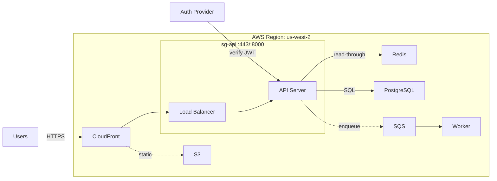
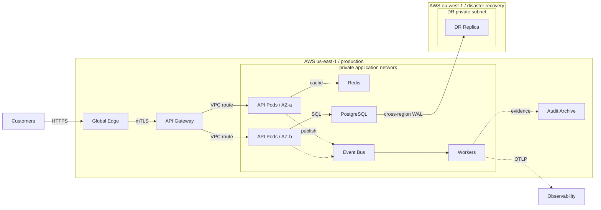
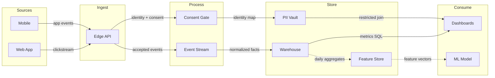
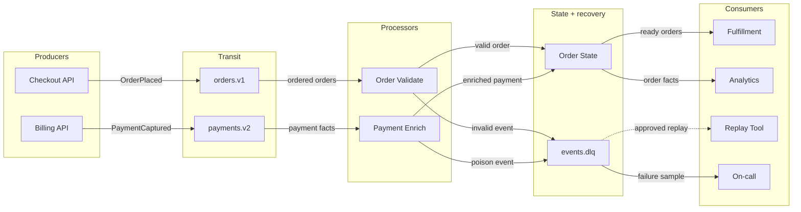

# Architecture and dataflow examples

Read only the case selected by [the scenario guide](diagrams.md). These examples are synthetic upstream teaching material, not evidence for a user's system. Mermaid preserves explicit nodes and relationships; adjacent tables and verbatim cards retain details that do not belong inside a node. Color, routing and compiler observations are illustrative; Mermaid may produce different geometry. No example establishes behavior absent from an authorized source.

## Sample Web App

Example: web-app.architecture.json.

**All participants and semantic details**

| ID | Label | Detail | Type | Tag | Group |
| --- | --- | --- | --- | --- | --- |
| users | Users | Browser / Mobile | external |  |  |
| auth | Auth Provider | OAuth 2.0 | security | JWT + PKCE |  |
| cdn | CloudFront | CDN | cloud |  |  |
| lb | Load Balancer | HTTPS :443 | cloud |  |  |
| api | API Server | FastAPI :8000 | backend |  |  |
| cache | Redis | cache :6379 | database |  |  |
| db | PostgreSQL | primary :5432 | database |  |  |
| s3 | S3 | static assets | cloud | OAI protected |  |
| queue | SQS | job queue | messagebus |  |  |
| worker | Worker | async jobs | backend |  |  |

**Relationship semantics**

| From → to | Label | Kind | Classification / role |
| --- | --- | --- | --- |
| users → cdn | HTTPS | emphasis |  |
| auth → api | verify JWT | security |  |
| cdn → lb |  | default |  |
| cdn → s3 | static | dashed |  |
| lb → api |  | default |  |
| api → cache | read-through | default |  |
| api → db | SQL | default |  |
| api → queue | enqueue | dashed |  |
| queue → worker |  | default |  |

Boundary **AWS Region: us-west-2** (region): cdn, lb, api, cache, db, s3, queue, worker.

Boundary **sg-api :443/:8000** (security-group): lb, api.

**Primary request path** (users, cdn, lb, api, db): Follow the primary customer request from the edge to durable state.

**Identity and cache** (auth, api, cache): Isolate authentication and the read-through cache beside the request path.

**Static and async work** (cdn, s3, api, queue, worker): See the two secondary paths without adding noise to the main request.

**Edge**

- CloudFront CDN fronts all traffic
- S3 serves static assets via OAI

**Application**

- FastAPI behind an HTTPS load balancer
- Redis read-through cache
- Async work drained from SQS by a worker

**Security**

- OAuth 2.0 with JWT + PKCE
- API + LB isolated in a security group

## Production Deployment Ownership

Example: production-deployment.architecture.json.

**All participants and semantic details**

| ID | Label | Detail | Type | Tag | Group |
| --- | --- | --- | --- | --- | --- |
| clients | Customers | web + mobile | external |  |  |
| edge | Global Edge | CDN + WAF | cloud | edge team |  |
| gateway | API Gateway | public :443 | security | platform |  |
| api_a | API Pods / AZ-a | private subnet | backend | app team |  |
| api_b | API Pods / AZ-b | private subnet | backend | app team |  |
| redis | Redis | multi-AZ cache | database | platform |  |
| postgres | PostgreSQL | primary / encrypted | database | data team |  |
| events | Event Bus | orders.v1 | messagebus | platform |  |
| worker | Workers | private workload | backend | app team |  |
| replica | DR Replica | eu-west-1 | database | data team |  |
| audit | Audit Archive | immutable objects | cloud | security |  |
| observability | Observability | metrics + traces | external | SRE |  |

**Relationship semantics**

| From → to | Label | Kind | Classification / role |
| --- | --- | --- | --- |
| clients → edge | HTTPS | emphasis |  |
| edge → gateway | mTLS | security |  |
| gateway → api_a | VPC route | emphasis |  |
| gateway → api_b | VPC route | emphasis |  |
| api_a → redis | cache | default |  |
| api_b → postgres | SQL | default |  |
| api_a → events | publish | dashed |  |
| api_b → events |  | dashed |  |
| events → worker |  | emphasis |  |
| postgres → replica | cross-region WAL | security |  |
| worker → audit | evidence | dashed |  |
| worker → observability | OTLP | dashed |  |

Boundary **AWS us-east-1 / production** (region): edge, gateway, api_a, api_b, redis, postgres, events, worker, audit.

Boundary **private application network** (security-group): api_a, api_b, redis, postgres, events, worker.

Boundary **AWS eu-west-1 / disaster recovery** (region): replica.

Boundary **DR private subnet** (security-group): replica.

**Request crosses the edge** (clients, edge, gateway, api_a, api_b): Follow public traffic into the private application network.

**State and ownership** (api_a, api_b, redis, postgres, replica): Separate stateless platform workloads from data-team-owned state.

**Async and operations** (api_b, events, worker, audit, observability): See the asynchronous work and the evidence it emits.

**Runtime Ownership**

- Platform owns the edge, gateway, cache, and event bus
- Application teams own API pods and workers
- Data owns primary and disaster-recovery state

**Named Crossings**

- Public HTTPS terminates at the managed edge
- mTLS crosses into the application network
- Cross-region WAL is explicit and encrypted

**Operational Evidence**

- Workers emit traces to SRE-owned observability
- Audit evidence lands in immutable storage
- Unknown placement should remain marked, never invented

## Product Analytics Data Flow

Example: product-analytics.dataflow.json.

**All participants and semantic details**

| ID | Label | Detail | Type | Tag | Group |
| --- | --- | --- | --- | --- | --- |
| web | Web App | browser SDK | frontend | events | Sources |
| mobile | Mobile | iOS / Android | frontend | events | Sources |
| edge | Edge API | collector | cloud | TLS | Ingest |
| consent | Consent Gate | policy filter | security | PII guard | Process |
| stream | Event Stream | Kafka topic | messagebus | ordered | Process |
| pii | PII Vault | encrypted | security | restricted | Store |
| warehouse | Warehouse | analytics tables | database | curated | Store |
| features | Feature Store | daily batch | database | derived | Store |
| dashboard | Dashboards | product metrics | backend | SQL | Consume |
| model | ML Model | ranking job | backend | features | Consume |

**Relationship semantics**

| From → to | Label | Kind | Classification / role |
| --- | --- | --- | --- |
| web → edge | clickstream | emphasis | user events |
| mobile → edge | app events | default | device events |
| edge → consent | identity + consent | security | PII touch |
| edge → stream | accepted events | emphasis | append-only |
| consent → pii | identity map | security | encrypted PII |
| stream → warehouse | normalized facts | emphasis | non-PII |
| warehouse → features | daily aggregates | dashed | batch |
| warehouse → dashboard | metrics SQL | default | read-only |
| features → model | feature vectors | dashed | derived |
| pii → dashboard | restricted join | security | approved only |

**Collection path** (web, mobile, edge, stream): Follow product events from clients into the ordered event stream.

**Consent and PII** (edge, consent, pii): Isolate the policy gate and restricted identity store.

**Curated consumers** (stream, warehouse, dashboard, features, model): See curated facts, dashboards, and the derived feature path.

**Primary Data Path**

- Events move left to right through source, ingest, process, store, and consume stages
- The hot path stays visually clear even with secondary batch flows
- Labels name data assets instead of generic API verbs

**Sensitive Boundary**

- Consent and PII paths are styled as security flows
- PII lands in a restricted vault, separate from the analytics warehouse
- Restricted joins are visible without implying default access

**Derived Consumers**

- Dashboards read curated facts from the warehouse
- Feature vectors are derived by batch from analytics tables
- Consumption paths stay distinct from collection and consent handling

## Order Event-stream Topology

Example: event-stream.dataflow.json.

**All participants and semantic details**

| ID | Label | Detail | Type | Tag | Group |
| --- | --- | --- | --- | --- | --- |
| checkout | Checkout API | order producer | frontend | team commerce | Producers |
| billing | Billing API | payment producer | backend | team money | Producers |
| orders | orders.v1 | 12 partitions | messagebus | key: order_id | Transit |
| payments | payments.v2 | 8 partitions | messagebus | key: order_id | Transit |
| validate | Order Validate | group fulfillment | backend | ordered | Processors |
| enrich | Payment Enrich | group analytics | backend | at-least-once | Processors |
| state | Order State | materialized view | database | idempotent | State + recovery |
| dlq | events.dlq | poison events | messagebus | 7-day retention | State + recovery |
| fulfillment | Fulfillment | shipping workflow | backend | consumer | Consumers |
| analytics | Analytics | streaming facts | database | consumer | Consumers |
| replay | Replay Tool | approved batch | security | operator gate | Consumers |
| ops | On-call | DLQ owner | external | SRE | Consumers |

**Relationship semantics**

| From → to | Label | Kind | Classification / role |
| --- | --- | --- | --- |
| checkout → orders | OrderPlaced | emphasis | schema v1 |
| billing → payments | PaymentCaptured | emphasis | schema v2 |
| orders → validate | ordered orders | emphasis | consumer group |
| payments → enrich | payment facts | emphasis | at-least-once |
| validate → state | valid order | emphasis | idempotent |
| enrich → state | enriched payment | default | idempotent |
| state → fulfillment | ready orders | emphasis | read model |
| state → analytics | order facts | default | non-PII |
| validate → dlq | invalid event | security | dead letter |
| enrich → dlq | poison event | security | dead letter |
| dlq → ops | failure sample | security | restricted |
| dlq → replay | approved replay | dashed | audited batch |

**Order event transit** (checkout, orders, validate, state, fulfillment): Follow an order from producer through ordered processing to fulfillment.

**Payment event transit** (billing, payments, enrich, state, analytics): Track payment facts into the shared materialized state and analytics.

**Failure and replay** (validate, enrich, dlq, replay, ops): Isolate dead letters, operator review, and controlled replay ownership.

**Transit Contract**

- Every event and topic is named
- Partition keys preserve per-order ordering
- Consumer groups expose processing ownership

**State + Delivery**

- Processors write an idempotent materialized view
- Fulfillment and analytics consume distinct assets
- At-least-once delivery never implies duplicate business effects

**Failure Ownership**

- Poison events land in a retained dead-letter topic
- On-call inspects samples before replay
- Replay is gated, batched, and auditable
