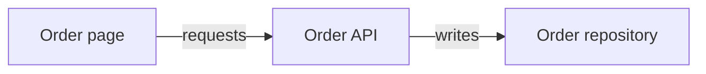
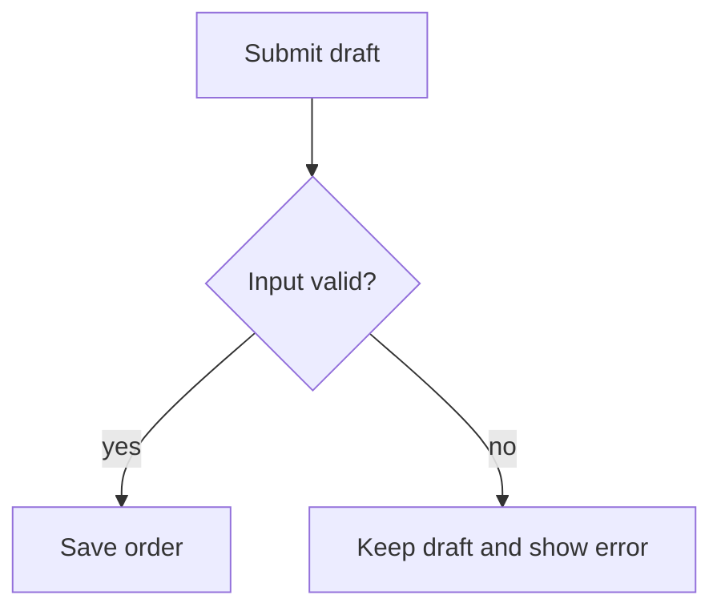
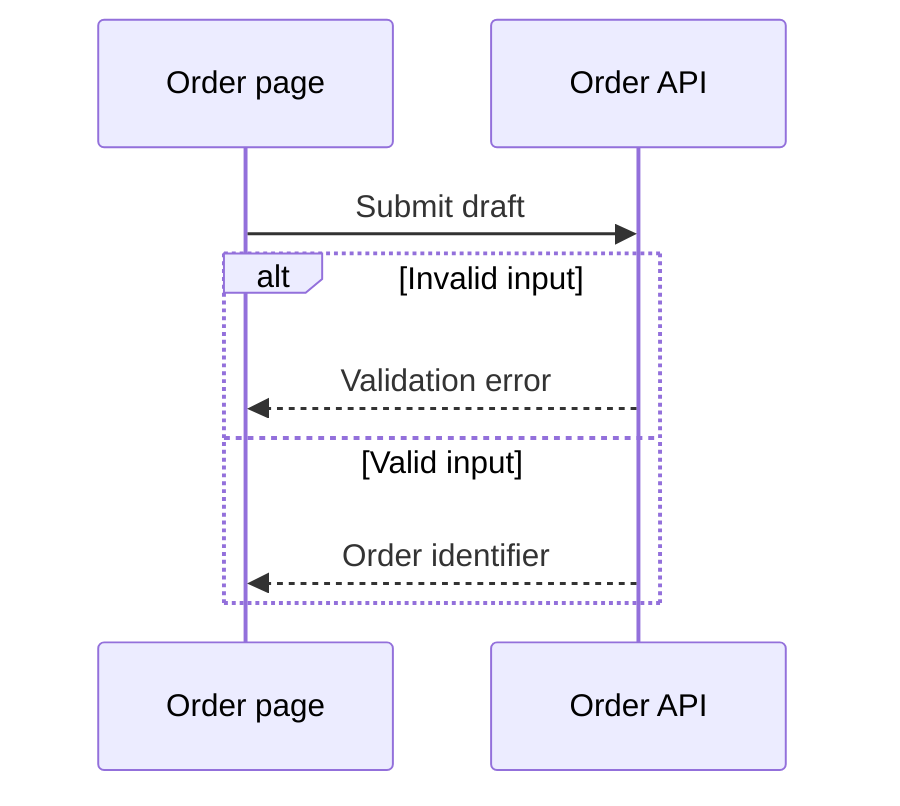
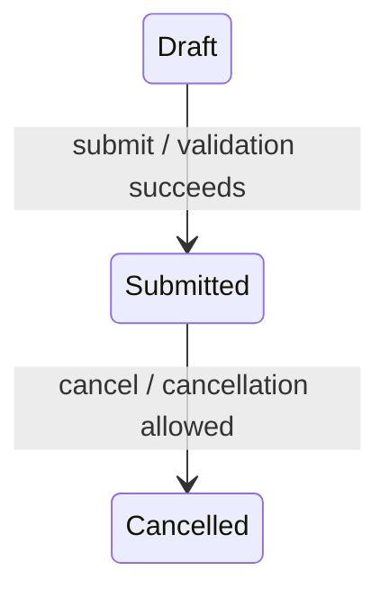
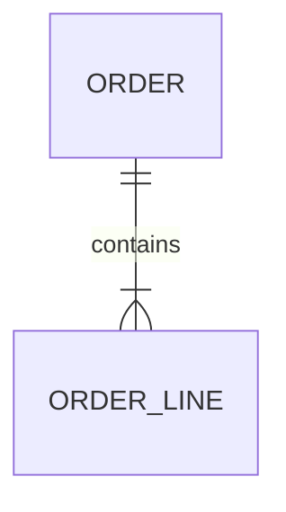

# Source-grounded diagrams

Use a diagram only when it clarifies a reader task better than prose or a table.
This guidance applies to existing templates and selected article programs alike.
It does not require a diagram, create a new article type, or add a completion gate.

## Choose the representation

| Reader question | Representation | Place in the article |
| --- | --- | --- |
| Which layers or services depend on each other? | Mermaid `flowchart LR` | Architecture or dependencies, after the scope |
| What action happens next, including failures? | Mermaid `flowchart TD` | Behavior or business flow |
| Who communicates, and in what order? | Mermaid `sequenceDiagram` | Request, integration or event processing |
| What changes state, under which conditions? | Mermaid `stateDiagram-v2` | State behavior, alongside transition evidence |
| How are persisted entities related? | Mermaid `erDiagram` | Data model, beside the entity/relationship table |
| Where are files, articles or component parts? | Fenced `text` tree | Entry map or composition |
| What are exact fields, routes, keys or source locations? | Markdown table | Contract, catalog or source references |
| What does a component or visual foundation look like? | Authorized source image with caption and text | Usage or design foundation; diagrams do not prove visual appearance |

A domain concept relationship can use a labeled flowchart rather than pretending
it is a database ER model. Unrelated entities belong in a catalog table. Do not
infer transitions from enum order, cardinality from field names, runtime calls
from package dependencies, or sequencing from a list of imports.

## Writing and evidence

Start with one sentence stating what the diagram explains and its applicable
scope/version. Follow it with a short explanation and source coordinates or a
compact node/edge-to-source table. The reader must still have a useful next
inspection step when the consumer cannot render Mermaid. Keep Mermaid fenced
source in the article; do not replace the only editable representation with an image.

Every asserted relationship needs support in the authorized source. A registered
route does not prove runtime access; a client contract does not prove a call.
Stop at a named external boundary when its implementation is unavailable and say
what material is needed next. Keep proposals and historical accounts explicitly
labeled; notes and conversations do not automatically establish current behavior.
Do not copy a source diagram without checking its version and evidence scope.

One diagram answers one question. Split an unreadable graph by responsibility,
not an arbitrary node limit. Link related diagrams instead of repeating them in
an overview, API page and source-entry page. A short page can omit the diagram.

## Style

- Prefer simple Mermaid constructs: flowchart, sequenceDiagram, stateDiagram-v2
  and erDiagram. Use `text` for trees, not large ASCII boxes for relationships.
- Prefer left-to-right for architecture and top-to-bottom for decisions. Use
  subgraphs only for real ownership, process or deployment boundaries.
- Use short stable ASCII node IDs and quoted human-readable labels in the reader's
  language. Preserve exact service, API and state identifiers where they matter.
- Label edges with the relation or action. Sequence arrows show communication;
  state arrows show a named trigger/condition. Do not reuse an unexplained arrow
  for imports, runtime calls and data ownership.
- Keep default theme and simple shapes. Avoid custom HTML, scripts, click actions,
  remote icons, theme directives and color-only meanings. Do not hardcode a canvas
  size; let the consumer theme and layout render it.
- Put long paths and citations outside node labels. Unknown relationships are
  explained in text, not connected speculatively to make the picture complete.
- An optional syntax/render warning is not a writing gate. Correct malformed
  syntax or retain the accurate textual explanation; do not invent evidence to
  satisfy a diagram checker. Never claim rendering was tested unless it was.

## Small anonymous examples

The following fragments demonstrate notation only; they are not facts to copy.
Use only the fragment whose relationships are supported by the current source.

Architecture: the two arrows describe different, explicit relationships.



Decision flow: a failed validation has a visible outcome.



Sequence: branches are supported outcomes, not asserted deployment success.



State: include this only when the transition implementation or specification is known.



ER: the cardinality must come from a schema or supported relationship contract.



Tree: directory membership does not imply runtime invocation.

```text
Order module
├── Entry and scope
├── Request contract
└── Source investigation
```
