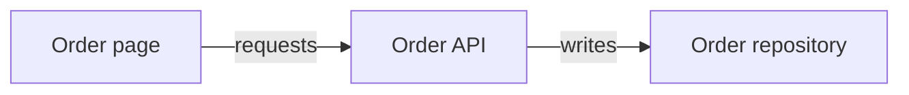
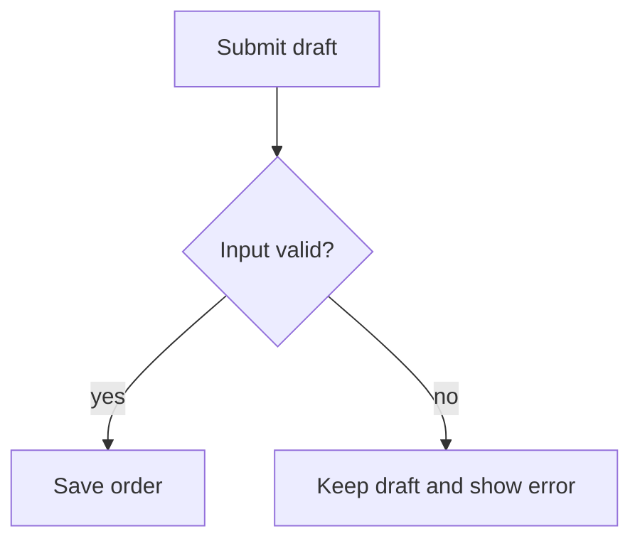
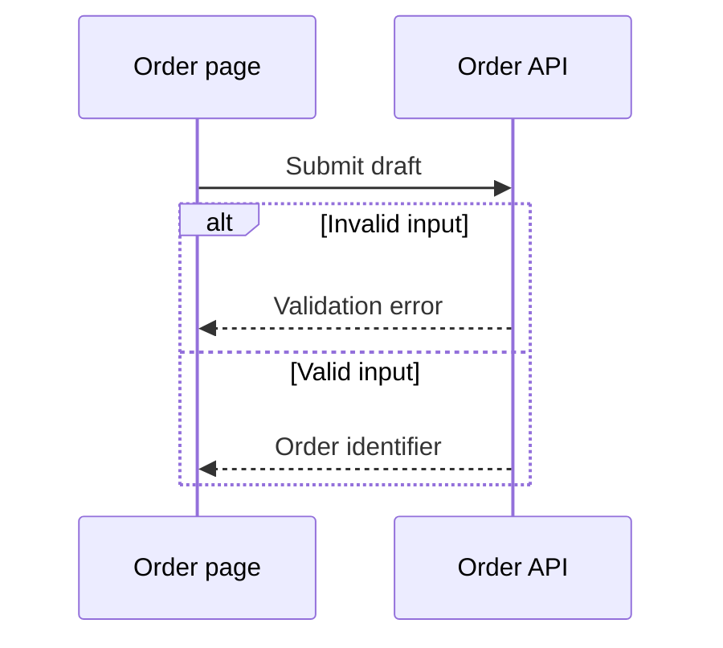
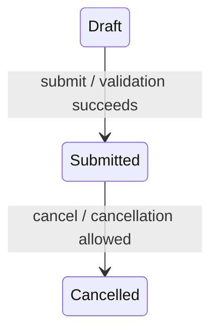
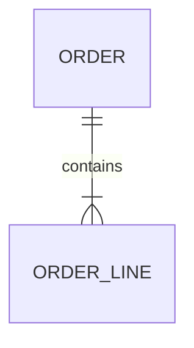

# Source-grounded diagrams

Use a diagram only when it clarifies a reader task better than prose or a table.
This guidance applies to existing templates and selected article programs alike.
It does not require a diagram, create a new article type, or add a completion gate.

## Choose the representation

| Reader question | Representation | Place in the article |
| --- | --- | --- |
| Which layers or services depend on each other? | Mermaid `flowchart LR` | Architecture or dependencies, after the scope |
| What action happens next, including failures? | Mermaid `flowchart TD` | Behavior or business flow |
| Who communicates, and in what order? | Mermaid `sequenceDiagram` | Request, integration or event processing |
| What changes state, under which conditions? | Mermaid `stateDiagram-v2` | State behavior, alongside transition evidence |
| How are persisted entities related? | Mermaid `erDiagram` | Data model, beside the entity/relationship table |
| Where are files, articles or component parts? | Fenced `text` tree | Entry map or composition |
| What are exact fields, routes, keys or source locations? | Markdown table | Contract, catalog or source references |
| What does a component or visual foundation look like? | Authorized source image with caption and text | Usage or design foundation; diagrams do not prove visual appearance |

A domain concept relationship can use a labeled flowchart rather than pretending
it is a database ER model. Unrelated entities belong in a catalog table. Do not
infer transitions from enum order, cardinality from field names, runtime calls
from package dependencies, or sequencing from a list of imports.

## Writing and evidence

Start with one sentence stating what the diagram explains and its applicable
scope/version. Follow it with a short explanation and source coordinates or a
compact node/edge-to-source table. The reader must still have a useful next
inspection step when the consumer cannot render Mermaid. Keep Mermaid fenced
source in the article; do not replace the only editable representation with an image.

Every asserted relationship needs support in the authorized source. A registered
route does not prove runtime access; a client contract does not prove a call.
Stop at a named external boundary when its implementation is unavailable and say
what material is needed next. Keep proposals and historical accounts explicitly
labeled; notes and conversations do not automatically establish current behavior.
Do not copy a source diagram without checking its version and evidence scope.

One diagram answers one question. Split an unreadable graph by responsibility,
not an arbitrary node limit. Link related diagrams instead of repeating them in
an overview, API page and source-entry page. A short page can omit the diagram.

## Style

- Prefer simple Mermaid constructs: flowchart, sequenceDiagram, stateDiagram-v2
  and erDiagram. Use `text` for trees, not large ASCII boxes for relationships.
- Prefer left-to-right for architecture and top-to-bottom for decisions. Use
  subgraphs only for real ownership, process or deployment boundaries.
- Use short stable ASCII node IDs and quoted human-readable labels in the reader's
  language. Preserve exact service, API and state identifiers where they matter.
- Label edges with the relation or action. Sequence arrows show communication;
  state arrows show a named trigger/condition. Do not reuse an unexplained arrow
  for imports, runtime calls and data ownership.
- Keep default theme and simple shapes. Avoid custom HTML, scripts, click actions,
  remote icons, theme directives and color-only meanings. Do not hardcode a canvas
  size; let the consumer theme and layout render it.
- Put long paths and citations outside node labels. Unknown relationships are
  explained in text, not connected speculatively to make the picture complete.
- An optional syntax/render warning is not a writing gate. Correct malformed
  syntax or retain the accurate textual explanation; do not invent evidence to
  satisfy a diagram checker. Never claim rendering was tested unless it was.

## Small anonymous examples

The following fragments demonstrate notation only; they are not facts to copy.
Use only the fragment whose relationships are supported by the current source.

Architecture: the two arrows describe different, explicit relationships.



Decision flow: a failed validation has a visible outcome.



Sequence: branches are supported outcomes, not asserted deployment success.



State: include this only when the transition implementation or specification is known.



ER: the cardinality must come from a schema or supported relationship contract.



Tree: directory membership does not imply runtime invocation.

```text
Order module
├── Entry and scope
├── Request contract
└── Source investigation
```

## Complete scenario recipes

The following eleven bilingual recipes retain Archify's original question, summary, applicability, exclusions, required elements and prompts without abridgment. Read the matching scenario here; use [topology examples](diagram-topology-examples.md) for architecture/dataflow and [behavior examples](diagram-behavior-examples.md) for workflow/sequence/lifecycle. Do not read both example collections unless the article needs both.

**Context execution:** quoted prompts describe the upstream authoring intent. Produce the Mermaid representation listed for the recipe inside the existing article, not an Archify JSON file. Existing source authorization and Review apply. Upstream component counts are composition suggestions, not a Context quota; split by reader task. Do not add approval gates, deployment profiles, custom cards, animation, pixel coordinates or an Archify CLI dependency. Investigate the listed elements; include only supported behavior. If unavailable, state the specific unknown in prose.

### 1. System overview / 系统总览

Mermaid: `flowchart LR`.

**English**

- **Question:** What exists, who owns it, and how is it connected?
- **Summary:** A bounded map of core components, external dependencies, primary paths, and trust boundaries.
- **Use when:** Onboarding, design reviews, repository orientation, or explaining a service landscape.
- **Avoid when:** The audience needs exact call order, state transitions, or row-level data lineage.
- **Include:** 8–12 core components; one primary path; external dependencies; trust boundaries

> Analyze this repository, then use Archify to create a high-level architecture diagram. Show 8–12 core runtime components, one primary request or data path, external dependencies, ownership or trust boundaries, and put supporting detail in cards instead of adding more edges.

Description-first prompt:

> Use Archify to turn this plain-language system description into a high-level architecture diagram: [describe the users, core components, primary path, external dependencies, and boundaries]. No repository is required. Ask only for missing facts that would materially change the diagram, mark any remaining unknowns instead of inventing them, and keep one obvious primary path across 8–12 core components.

**中文**

- **Question:** 系统里有什么、归谁负责、彼此如何连接？
- **Summary:** 用一张有边界的图展示核心组件、外部依赖、主路径和信任边界。
- **Use when:** 适合新人上手、方案评审、仓库梳理和服务全景说明。
- **Avoid when:** 如果重点是精确调用顺序、状态流转或字段级血缘，请换其他配方。
- **Include:** 8–12 个核心组件; 一条主路径; 外部依赖; 归属或信任边界

> 分析这个仓库，然后用 Archify 生成高层系统架构图。展示 8–12 个核心运行时组件、一条主要请求或数据路径、外部依赖、归属或信任边界；支持性细节放进卡片，不要继续堆连线。

Description-first prompt:

> 用 Archify 把下面这段自然语言系统描述画成高层架构图：[在这里描述用户、核心组件、主要路径、外部依赖和边界]。不需要代码库。只追问会实质影响图的缺失信息，其余不确定内容要标明而不是编造；保留 8–12 个核心组件和一条一眼可见的主路径。

### 2. Deployment ownership / 部署与归属

Mermaid: `flowchart LR`.

**English**

- **Question:** Where does each workload run, and what crosses a boundary?
- **Summary:** A deployment-focused map of regions, networks, clusters, workloads, stores, and cross-boundary mechanisms.
- **Use when:** Cloud reviews, production readiness, multi-region planning, or infrastructure ownership handoffs.
- **Avoid when:** Deployment facts are unknown or the real question is application behavior rather than placement.
- **Include:** regions and networks; workload ownership; stateful services; named boundary crossings

> Use Archify to draw the production deployment topology. Group resources by region, network, cluster, and owner; show workloads and stateful services; label every cross-boundary mechanism. Do not invent deployment facts—mark unknown areas explicitly. If the user wants a fail-closed deployment review, ask before setting meta.engineering_profile to deployment-ownership; otherwise leave the engineering profile unset.

**中文**

- **Question:** 每个工作负载运行在哪里，哪些连接跨越了边界？
- **Summary:** 围绕 Region、网络、集群、工作负载、存储和跨边界机制组织部署图。
- **Use when:** 适合云上评审、生产就绪、多区域规划和基础设施交接。
- **Avoid when:** 部署事实不清楚，或真正问题是应用行为而不是资源位置时不要使用。
- **Include:** 区域与网络; 工作负载归属; 有状态服务; 明确的跨边界机制

> 用 Archify 绘制生产部署拓扑。按区域、网络、集群和负责人分组，展示工作负载与有状态服务，并标注每一种跨边界机制。不要编造部署事实，不确定的区域要明确标出。如果用户需要失败即阻断的部署评审，先征得确认，再把 meta.engineering_profile 设为 deployment-ownership；否则不要启用工程画像。

### 3. Agent tool-call loop / 智能体工具调用

Mermaid: `flowchart TD`.

**English**

- **Question:** How does an agent plan, get permission, act, recover, and report?
- **Summary:** A lane-based agent loop with policy gates, tool execution, exception recovery, evidence, and final response.
- **Use when:** Explaining agent runtimes, MCP/tool orchestration, approvals, retries, or observability.
- **Avoid when:** The goal is only to show static agent components or exact API message timing.
- **Include:** request and planning; policy or approval gate; tool execution; exception and evidence paths

> Use Archify workflow mode to explain this agent tool-call loop. Separate user surface, agent runtime, policy boundary, exception handling, tool execution, and observability into lanes. Make the successful path primary and show approval, retry, blocked, and evidence paths explicitly.

Description-first prompt:

> Use Archify workflow mode to turn this description into a diagram: [paste the actors, main steps, decisions, approvals, and exception paths]. Use lanes for distinct owners, keep one unmistakable happy path, and mark missing ownership or unresolved branches instead of inventing them.

**中文**

- **Question:** 智能体如何规划、获批、执行、恢复并汇报？
- **Summary:** 用泳道表达策略门、工具执行、异常恢复、证据和最终回复。
- **Use when:** 适合解释 Agent Runtime、MCP/工具编排、审批、重试和可观测性。
- **Avoid when:** 如果只想看静态组件，或重点是精确 API 消息时序，请换其他配方。
- **Include:** 请求与规划; 策略或审批门; 工具执行; 异常与证据路径

> 用 Archify 工作流模式解释这段智能体工具调用。把用户界面、Agent Runtime、策略边界、异常处理、工具执行和可观测性分成泳道；突出成功主路径，并明确展示审批、重试、阻塞和证据路径。

Description-first prompt:

> 用 Archify 工作流模式把下面的描述画成图：[粘贴参与者、主要步骤、决策、审批和异常路径]。不同负责方使用独立泳道，保留一条明确的成功主路径，缺失的负责人或未定分支要标明而不是编造。

### 4. Delivery workflow / 研发交付流程

Mermaid: `flowchart TD`.

**English**

- **Question:** How does a change move safely from commit to production?
- **Summary:** A delivery flow with build, checks, environments, approvals, smoke tests, rollback, and ownership lanes.
- **Use when:** CI/CD design, release reviews, deployment governance, or onboarding developers to delivery.
- **Avoid when:** The question is where infrastructure runs or what states a deployment object can occupy.
- **Include:** trigger and build; blocking checks; approval and environments; rollback and verification

> Use Archify workflow mode to draw this delivery process from commit to production. Separate developer, CI, approval, environment, and exception lanes; mark blocking checks, smoke tests, ownership, and the rollback path. Keep one unmistakable happy path.

**中文**

- **Question:** 一次变更如何安全地从提交走到生产？
- **Summary:** 展示构建、检查、环境、审批、冒烟、回滚和负责人泳道。
- **Use when:** 适合 CI/CD 设计、发布评审、部署治理和研发新人上手。
- **Avoid when:** 如果重点是基础设施位置或部署对象的状态集合，请换架构图或生命周期图。
- **Include:** 触发与构建; 阻断检查; 审批与环境; 回滚与验证

> 用 Archify 工作流模式绘制从代码提交到生产发布的流程。拆分开发者、CI、审批、环境和异常泳道；标出阻断检查、冒烟测试、负责人和回滚路径，并保留一条一眼可见的成功主路径。

### 5. Incident runbook / 事故处置 Runbook

Mermaid: `flowchart TD`.

**English**

- **Question:** How do responders detect, triage, mitigate, verify, and escalate?
- **Summary:** An operational workflow that separates signals, responders, mitigation, communications, and recovery proof.
- **Use when:** Incident playbooks, on-call handoffs, reliability reviews, and tabletop exercises.
- **Avoid when:** The audience needs live metrics or a post-incident component topology instead of response actions.
- **Include:** detection signal; triage owner; mitigation and rollback; verification and communication

> Use Archify workflow mode to turn this incident runbook into responder lanes. Show detection, triage, mitigation, escalation, communication, rollback, and recovery verification. Separate decision gates from actions and make missing ownership visible.

**中文**

- **Question:** 响应者如何发现、分诊、缓解、验证并升级？
- **Summary:** 把信号、响应者、缓解动作、沟通和恢复证据拆成可执行流程。
- **Use when:** 适合故障预案、On-call 交接、稳定性评审和桌面演练。
- **Avoid when:** 如果受众需要实时指标仪表盘或事故后的组件拓扑，而不是响应动作，请换其他视图。
- **Include:** 发现信号; 分诊负责人; 缓解与回滚; 恢复验证与沟通

> 用 Archify 工作流模式把事故处置预案画成响应者泳道。展示发现、分诊、缓解、升级、沟通、回滚和恢复验证；把决策门与操作分开，并让缺失的负责人清晰可见。

### 6. API request chain / API 请求链

Mermaid: `sequenceDiagram`.

**English**

- **Question:** Who calls whom, in what order, and what returns?
- **Summary:** A time-ordered request path with authentication, cache fallback, persistence, return traffic, and async trace.
- **Use when:** API documentation, debugging request latency, auth reviews, or explaining cache fallback.
- **Avoid when:** Order is unimportant and the audience only needs the stable service topology.
- **Include:** callers and callees; request and return messages; fallback or error path; async side effects

> Use Archify sequence mode to show this request from caller to final response. Include authentication, cache hit or miss, persistence fallback, return messages, and asynchronous trace or event emission. Keep message labels short and order unambiguous.

Description-first prompt:

> Use Archify sequence mode to draw this interaction: [paste the participants, calls, returns, fallback, and asynchronous side effects]. Keep message order unambiguous, labels short, and unknown behavior explicit. No repository is required.

**中文**

- **Question:** 谁调用谁、顺序如何、最终返回什么？
- **Summary:** 按时间展示鉴权、缓存回退、持久化、返回流量和异步追踪。
- **Use when:** 适合 API 文档、请求耗时排查、鉴权评审和缓存回退说明。
- **Avoid when:** 如果顺序不重要，受众只需要稳定的服务拓扑，请用架构图。
- **Include:** 调用方与被调用方; 请求与返回消息; 回退或错误路径; 异步副作用

> 用 Archify 时序模式展示从调用方到最终响应的完整请求。包含鉴权、缓存命中或未命中、持久化回退、返回消息，以及异步 Trace 或事件上报；消息标签保持简短，顺序必须明确。

Description-first prompt:

> 用 Archify 时序模式绘制下面的交互：[粘贴参与者、调用、返回、回退和异步副作用]。确保消息顺序无歧义、标签简短，并明确标注未知行为。不需要代码库。

### 7. Async roundtrip / 异步往返链路

Mermaid: `sequenceDiagram`.

**English**

- **Question:** What happens after the initial request returns?
- **Summary:** A sequence view of enqueue, acknowledgement, background work, callbacks, retries, timeout, and final consistency.
- **Use when:** Webhooks, jobs, queues, payment callbacks, eventual consistency, or async API contracts.
- **Avoid when:** The primary question is topic topology and consumer ownership rather than time order.
- **Include:** initial acknowledgement; queue or scheduler; background work; callback, retry, and timeout

> Use Archify sequence mode to explain this asynchronous roundtrip. Show the initial acknowledgement, enqueue or scheduling step, background processing, callback or polling, retry and timeout behavior, and the point where the caller can observe final consistency.

**中文**

- **Question:** 初始请求返回之后，后台还会发生什么？
- **Summary:** 按时间展示入队、确认、后台处理、回调、重试、超时和最终一致。
- **Use when:** 适合 Webhook、后台任务、队列、支付回调、最终一致和异步 API 契约。
- **Avoid when:** 如果重点是 Topic 拓扑和消费者归属，而不是时间顺序，请用事件数据流配方。
- **Include:** 初始确认; 队列或调度器; 后台处理; 回调、重试与超时

> 用 Archify 时序模式解释这段异步往返链路。展示初始确认、入队或调度、后台处理、回调或轮询、重试与超时，以及调用方何时能观察到最终一致结果。

### 8. Data lineage / 数据血缘

Mermaid: `flowchart LR`.

**English**

- **Question:** Where does data come from, how does it change, and who consumes it?
- **Summary:** A governed path from sources through consent, transforms, sensitive stores, warehouse, and consumers.
- **Use when:** Analytics architecture, ETL/ELT review, PII assessment, warehouse design, or model feature lineage.
- **Avoid when:** The audience needs request timing or operational task ownership rather than data assets.
- **Include:** sources and assets; transform stages; classification or consent; stores and consumers

> Use Archify dataflow mode to map this data lineage. Name every data asset and transform, show consent or classification boundaries, distinguish streaming from batch paths, and identify stores plus downstream consumers. Do not use unlabeled flows.

**中文**

- **Question:** 数据从哪里来、如何变化、最终被谁消费？
- **Summary:** 从来源经过同意、转换、敏感存储、数仓直到消费者的治理路径。
- **Use when:** 适合分析架构、ETL/ELT 评审、PII 评估、数仓设计和特征血缘。
- **Avoid when:** 如果受众需要请求时序或操作负责人，而不是数据资产，请换其他配方。
- **Include:** 数据来源与资产; 转换阶段; 分类或同意边界; 存储与消费者

> 用 Archify 数据流模式梳理这段数据血缘。为每个数据资产和转换命名，展示用户同意或数据分类边界，区分流式与批处理路径，并标明存储和下游消费者；所有数据流都必须有标签。

### 9. Event-stream topology / 事件流拓扑

Mermaid: `flowchart LR`.

**English**

- **Question:** Which events move through which topics, processors, groups, and failure paths?
- **Summary:** A stream map of producers, topics, ordered processors, consumer groups, state, replay, and DLQ.
- **Use when:** Kafka/event-platform design, stream processing reviews, ownership, replay, and failure handling.
- **Avoid when:** Topic names, consumer groups, and delivery semantics are not known—use a generic workflow instead.
- **Include:** producers and event names; topics and ordering; processors and consumer groups; state, replay, and DLQ

> Use Archify dataflow mode to draw this event-stream topology. Name producers, events, topics, ordered processors, consumer groups, state stores, replay paths, and the DLQ. Show ownership and delivery semantics only when supported by evidence.

Description-first prompt:

> Use Archify dataflow mode to map this data journey: [paste the sources, data assets, transforms, stores, boundaries, and consumers]. Label every flow, distinguish streaming from batch where relevant, and mark unknown classifications or ownership instead of inventing them.

**中文**

- **Question:** 哪些事件经过哪些 Topic、处理器、消费者组和失败路径？
- **Summary:** 展示生产者、Topic、有序处理器、消费者组、状态、重放和 DLQ。
- **Use when:** 适合 Kafka/事件平台设计、流处理评审、归属、重放和失败处理。
- **Avoid when:** 如果 Topic、消费者组和投递语义都不清楚，请先用通用工作流，不要编造事件拓扑。
- **Include:** 生产者与事件名; Topic 与顺序; 处理器与消费者组; 状态、重放与 DLQ

> 用 Archify 数据流模式绘制这段事件流拓扑。命名生产者、事件、Topic、有序处理器、消费者组、状态存储、重放路径和 DLQ；只有在证据充分时才标注归属和投递语义。

Description-first prompt:

> 用 Archify 数据流模式梳理下面的数据路径：[粘贴来源、数据资产、转换、存储、边界和消费者]。为每条数据流标注名称，在有意义时区分流式与批处理，未知的分类或归属要标明而不是编造。

### 10. Object lifecycle / 对象生命周期

Mermaid: `stateDiagram-v2`.

**English**

- **Question:** Which states exist, what events move between them, and how does it end?
- **Summary:** A state model with active work, waits, retries, cancellation, failure, and explicit terminal outcomes.
- **Use when:** Tasks, orders, tickets, subscriptions, jobs, agent runs, or any durable object with status.
- **Avoid when:** The object has no durable state and the real question is participant interaction over time.
- **Include:** start and active states; event-labelled transitions; wait and retry states; all terminal outcomes

> Use Archify lifecycle mode to model this object. Separate main progress, waiting or interruption states, and terminal outcomes. Label transitions with events, include retry, cancellation, timeout, success, and failure where real, and never hide an ending.

Description-first prompt:

> Use Archify lifecycle mode to model this object: [paste its states, transition events, waits, retries, cancellation, and terminal outcomes]. Separate active, waiting, recoverable-failure, and terminal states, and never hide an ending. No repository is required.

**中文**

- **Question:** 有哪些状态、什么事件触发流转、最终如何结束？
- **Summary:** 展示执行、等待、重试、取消、失败以及明确终态的状态模型。
- **Use when:** 适合任务、订单、工单、订阅、作业、Agent Run 等带持久状态的对象。
- **Avoid when:** 对象没有持久状态，真正问题是参与者随时间的交互时，请使用时序图。
- **Include:** 开始与执行态; 带事件的转换; 等待与重试态; 所有终态

> 用 Archify 生命周期模式建模这个对象。分开主进度、等待或中断状态和终态；用事件标注转换，并在真实存在时展示重试、取消、超时、成功和失败，不能隐藏任何结束方式。

Description-first prompt:

> 用 Archify 生命周期模式建模这个对象：[粘贴它的状态、转换事件、等待、重试、取消和终态]。分开执行、等待、可恢复失败和终态，不要隐藏任何结束方式。不需要代码库。

### 11. Deployment lifecycle / 部署生命周期

Mermaid: `stateDiagram-v2`.

**English**

- **Question:** What state is a release in, and what can happen next?
- **Summary:** A deployment state model covering queued, building, verifying, approval, promotion, rollback, and terminal outcomes.
- **Use when:** Release controllers, GitOps reconciliation, environment promotion, or deployment status APIs.
- **Avoid when:** The question is the human/CI sequence of delivery actions rather than the deployment object state.
- **Include:** queued and running states; verification and approval; promotion and rollback; success, failure, cancellation

> Use Archify lifecycle mode to model the deployment object. Show queued, building, verifying, waiting for approval, promoting, rolling back, and every terminal outcome. Label the events and guards that permit each transition.

**中文**

- **Question:** 一次发布当前处于什么状态，下一步可能发生什么？
- **Summary:** 覆盖排队、构建、验证、审批、晋级、回滚和终态的部署状态模型。
- **Use when:** 适合发布控制器、GitOps 对账、环境晋级和部署状态 API。
- **Avoid when:** 如果重点是人员与 CI 的交付动作顺序，而不是部署对象状态，请用交付工作流。
- **Include:** 排队与执行态; 验证与审批; 晋级与回滚; 成功、失败与取消

> 用 Archify 生命周期模式建模部署对象。展示排队、构建、验证、等待审批、晋级、回滚以及所有终态，并标注允许每次状态转换的事件和守卫条件。

## Composition and repair

The following authoring guidance applies across the recipes. Keep one clear primary path; short branches begin near their cause. Group only real ownership, trust, process or deployment boundaries. Keep external actors outside a system when supported. A group never substitutes for a relationship.

> Relationship labels are semantic data. If the gap is too small, move the label,
> adjust the route or spacing, then shorten the wording while preserving meaning.
> Omit only wording already fully implied by both endpoints and carrying no
> protocol, action, direction, synchronous/asynchronous behavior, or
> cross-boundary mechanism. Preserve every meaningful label.
> Deleting it is not a spacing repair. If a relationship starts unlabeled because
> its endpoints fully imply it, explain why the wording is redundant; this is a
> semantic authoring choice, not a spacing repair.

- Workflow lanes express responsibility or phase. Keep the successful path progressing in one direction; place retries and exceptions away from it without deleting their return edges. Mermaid subgraphs may express responsibility, but do not imply a pixel-perfect swimlane renderer.
- Sequence participants follow conversation roles and messages preserve temporal order. Return, asynchronous and security distinctions express meaning, not decoration. Show acceptance separately from observable completion; preserve callbacks, polling, retry and timeout conditions that the source actually provides.
- Dataflow stages express transformation or custody; parallel paths represent distinct streams. Preserve asset names, classifications, consent, stores, streaming/batch distinctions and consumers. Put exact partition counts and detailed schemas beside the diagram when they impede reading.
- A recoverable failure needs a real transition back to an active state. A card or guided view saying “retry” is not topology. Waiting requires its resume event; preserve supported terminal exits. Never manufacture a resume edge missing from the evidence.
- Keep a concise title; do not repeat its contents in a subtitle. Follow the requested language for labels and explanatory prose, preserving exact product, API, protocol, state and code identifiers. Theme changes do not translate authored content.
- For repository-based architecture, inspect entrypoints, runtime boundaries, storage, transports and deployment configuration before drawing. File proximity and names do not establish runtime causality. Use existing source references and fixed source revisions.

Repair in order: (1) invalid syntax and missing node references; (2) overlapping nodes or unreadable group placement; (3) edges crossing unrelated nodes or misleading direction; (4) ambiguous crossings, shared corridors and long border runs; (5) label-to-node, label-to-label and label-to-edge collisions. Prefer reordering, direction/group adjustments and splitting independent questions before shortening text. Preserve protocols, actions, direction, synchronization and crossing mechanisms. Use real rendering diagnostics when available; do not invent pixel offsets or delete meaning to pass a check.

| Counterexample | Correction |
| --- | --- |
| Imports or neighboring files become a runtime request chain | Trace a real caller and handler; otherwise label the diagram as a static dependency map |
| Deployment workflow drawn as a resource map | Choose workflow for actions, architecture for placement, state diagram for object transitions |
| Initial ACK labeled as successful completion | Show background work and the source-supported point at which the caller observes the final result |
| “Retry” appears only in a note | Draw the proven recovery transition; keep cancellation and expiry terminal when the source says so |
| All arrows look identical and labels vanish to reduce overlap | Preserve semantic direction and labels; adjust layout or split independent questions |
| Long citations, full paths and every field crowd nodes | Keep the relationship in the graph and put exact coordinates/fields in the adjacent text/table |
| Smaller fonts, clipped nodes or hidden edges make validation pass | Inspect the rendered graph at readable size; repair layout or split by responsibility |
| A syntax check is reported as visual approval | Report syntax, browser rendering and actual visual inspection separately |

## Verification claims

Archify distinguishes deterministic artifact checks, bounded browser evidence and perceptual visual review. Context should preserve that distinction: Mermaid parsing confirms syntax, a browser verifies actual rendering and interaction, and a human or image-capable reviewer judges readability. No one result proves the others. Retain text/source fallback; a diagram does not introduce a new workflow completion gate. Do not claim checks that were not run.

## Attribution

Scenario text, semantic guidance and example material derive from Archify (`tt-a1i/archify`, `tree/72c750b`), recipes/scenarios.mjs, references/authoring-contract.md, references/delivery-contract.md and examples. The original prompts above are quoted; the Mermaid execution guidance and counterexample table are Context adaptations. Upstream JSON geometry, schema machinery and viewer controls are not knowledge authoring requirements.

MIT License

Copyright (c) 2026 tt-a1i (Archify)
Copyright (c) 2025 Cocoon AI

Permission is hereby granted, free of charge, to any person obtaining a copy
of this software and associated documentation files (the "Software"), to deal
in the Software without restriction, including without limitation the rights
to use, copy, modify, merge, publish, distribute, sublicense, and/or sell
copies of the Software, and to permit persons to whom the Software is
furnished to do so, subject to the following conditions:

The above copyright notice and this permission notice shall be included in all
copies or substantial portions of the Software.

THE SOFTWARE IS PROVIDED "AS IS", WITHOUT WARRANTY OF ANY KIND, EXPRESS OR
IMPLIED, INCLUDING BUT NOT LIMITED TO THE WARRANTIES OF MERCHANTABILITY,
FITNESS FOR A PARTICULAR PURPOSE AND NONINFRINGEMENT. IN NO EVENT SHALL THE
AUTHORS OR COPYRIGHT HOLDERS BE LIABLE FOR ANY CLAIM, DAMAGES OR OTHER
LIABILITY, WHETHER IN AN ACTION OF CONTRACT, TORT OR OTHERWISE, ARISING FROM,
OUT OF OR IN CONNECTION WITH THE SOFTWARE OR THE USE OR OTHER DEALINGS IN THE
SOFTWARE.
